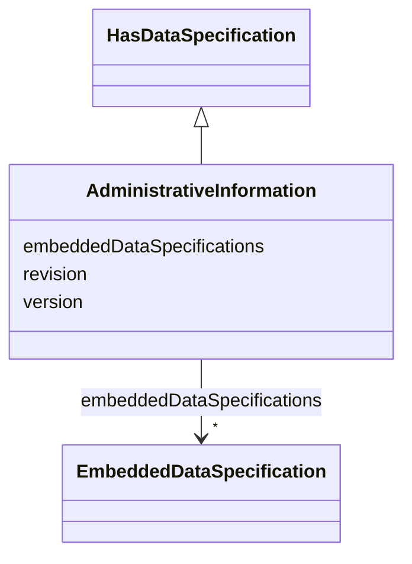

# Class: AdministrativeInformation 


_Administrative meta-information for an element like version information._


URI: [aas:AdministrativeInformation](https://admin-shell.io/aas/3/0/RC02/AdministrativeInformation)





## Inheritance
* [HasDataSpecification](HasDataSpecification.md)
    * **AdministrativeInformation**


## Slots

| Name | Cardinality and Range | Description | Inheritance |
| ---  | --- | --- | --- |
| [revision](revision.md) | 0..1 <br/> [String](String.md) | Revision of the element | direct |
| [version](version.md) | 0..1 <br/> [String](String.md) | Version of the element | direct |
| [embeddedDataSpecifications](embeddedDataSpecifications.md) | * <br/> [EmbeddedDataSpecification](EmbeddedDataSpecification.md) | Embedded data specification | [HasDataSpecification](HasDataSpecification.md) |


## Usages

| used by | used in | type | used |
| ---  | --- | --- | --- |
| [AssetAdministrationShell](AssetAdministrationShell.md) | [administration](administration.md) | range | [AdministrativeInformation](AdministrativeInformation.md) |
| [ConceptDescription](ConceptDescription.md) | [administration](administration.md) | range | [AdministrativeInformation](AdministrativeInformation.md) |
| [Identifiable](Identifiable.md) | [administration](administration.md) | range | [AdministrativeInformation](AdministrativeInformation.md) |
| [Submodel](Submodel.md) | [administration](administration.md) | range | [AdministrativeInformation](AdministrativeInformation.md) |


## Identifier and Mapping Information


### Schema Source


* from schema: https://admin-shell.io/aas/3/0/RC02


## Mappings

| Mapping Type | Mapped Value |
| ---  | ---  |
| self | aas:AdministrativeInformation |
| native | aas:AdministrativeInformation |


## LinkML Source

<!-- TODO: investigate https://stackoverflow.com/questions/37606292/how-to-create-tabbed-code-blocks-in-mkdocs-or-sphinx -->

### Direct

<details>
```yaml
name: AdministrativeInformation
description: Administrative meta-information for an element like version information.
from_schema: https://admin-shell.io/aas/3/0/RC02
is_a: HasDataSpecification
attributes:
  revision:
    name: revision
    description: Revision of the element.
    from_schema: https://admin-shell.io/aas/3/0/RC02
    rank: 1000
    domain_of:
    - AdministrativeInformation
    range: string
  version:
    name: version
    description: Version of the element.
    from_schema: https://admin-shell.io/aas/3/0/RC02
    rank: 1000
    domain_of:
    - AdministrativeInformation
    range: string

```
</details>

### Induced

<details>
```yaml
name: AdministrativeInformation
description: Administrative meta-information for an element like version information.
from_schema: https://admin-shell.io/aas/3/0/RC02
is_a: HasDataSpecification
attributes:
  revision:
    name: revision
    description: Revision of the element.
    from_schema: https://admin-shell.io/aas/3/0/RC02
    rank: 1000
    alias: revision
    owner: AdministrativeInformation
    domain_of:
    - AdministrativeInformation
    range: string
  version:
    name: version
    description: Version of the element.
    from_schema: https://admin-shell.io/aas/3/0/RC02
    rank: 1000
    alias: version
    owner: AdministrativeInformation
    domain_of:
    - AdministrativeInformation
    range: string
  embeddedDataSpecifications:
    name: embeddedDataSpecifications
    description: Embedded data specification.
    from_schema: https://admin-shell.io/aas/3/0/RC02
    rank: 1000
    alias: embeddedDataSpecifications
    owner: AdministrativeInformation
    domain_of:
    - HasDataSpecification
    range: EmbeddedDataSpecification
    multivalued: true

```
</details>