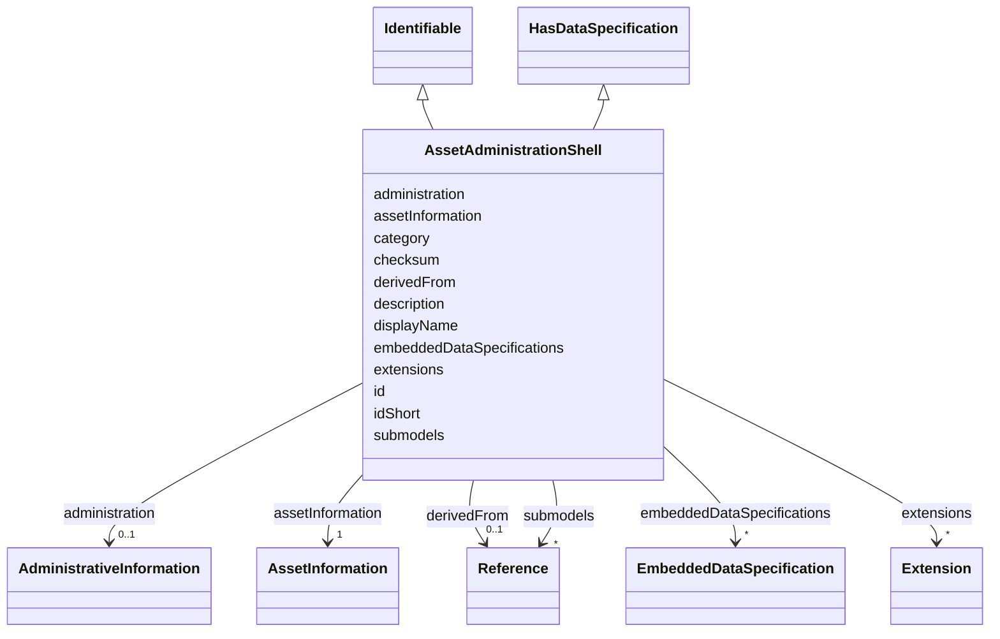

# Class: AssetAdministrationShell 


_An asset administration shell._


URI: [aas:AssetAdministrationShell](https://admin-shell.io/aas/3/0/RC02/AssetAdministrationShell)





## Inheritance
* **AssetAdministrationShell** [ [Identifiable](Identifiable.md) [HasDataSpecification](HasDataSpecification.md)]


## Slots

| Name | Cardinality and Range | Description | Inheritance |
| ---  | --- | --- | --- |
| [assetInformation](assetInformation.md) | 1 <br/> [AssetInformation](AssetInformation.md) | Meta-information about the asset the AAS is representing | direct |
| [derivedFrom](derivedFrom.md) | 0..1 <br/> [Reference](Reference.md) | The reference to the AAS the AAS was derived from | direct |
| [submodels](submodels.md) | * <br/> [Reference](Reference.md) | References to submodels of the AAS | direct |
| [administration](administration.md) | 0..1 <br/> [AdministrativeInformation](AdministrativeInformation.md) | Administrative information of an identifiable element | [Identifiable](Identifiable.md) |
| [id](id.md) | 1 <br/> [String](String.md) | The globally unique identification of the element | [Identifiable](Identifiable.md) |
| [embeddedDataSpecifications](embeddedDataSpecifications.md) | * <br/> [EmbeddedDataSpecification](EmbeddedDataSpecification.md) | Embedded data specification | [HasDataSpecification](HasDataSpecification.md) |
| [category](category.md) | 0..1 <br/> [String](String.md) | The category is a value that gives further meta information w | [Referable](Referable.md) |
| [checksum](checksum.md) | 0..1 <br/> [String](String.md) | Checksum to be used to determine if an Referable (including its aggregated ch... | [Referable](Referable.md) |
| [description](description.md) | * <br/> [LangString](LangString.md) | Description or comments on the element | [Referable](Referable.md) |
| [displayName](displayName.md) | * <br/> [LangString](LangString.md) | Display name | [Referable](Referable.md) |
| [idShort](idShort.md) | 0..1 <br/> [String](String.md) | In case of identifiables this attribute is a short name of the element | [Referable](Referable.md) |
| [extensions](extensions.md) | * <br/> [Extension](Extension.md) | An extension of the element | [HasExtensions](HasExtensions.md) |


## Usages

| used by | used in | type | used |
| ---  | --- | --- | --- |
| [Environment](Environment.md) | [assetAdministrationShells](assetAdministrationShells.md) | range | [AssetAdministrationShell](AssetAdministrationShell.md) |


## Identifier and Mapping Information


### Schema Source


* from schema: https://admin-shell.io/aas/3/0/RC02


## Mappings

| Mapping Type | Mapped Value |
| ---  | ---  |
| self | aas:AssetAdministrationShell |
| native | aas:AssetAdministrationShell |


## LinkML Source

<!-- TODO: investigate https://stackoverflow.com/questions/37606292/how-to-create-tabbed-code-blocks-in-mkdocs-or-sphinx -->

### Direct

<details>
```yaml
name: AssetAdministrationShell
description: An asset administration shell.
from_schema: https://admin-shell.io/aas/3/0/RC02
mixins:
- Identifiable
- HasDataSpecification
attributes:
  assetInformation:
    name: assetInformation
    description: Meta-information about the asset the AAS is representing.
    from_schema: https://admin-shell.io/aas/3/0/RC02
    rank: 1000
    domain_of:
    - AssetAdministrationShell
    range: AssetInformation
    required: true
  derivedFrom:
    name: derivedFrom
    description: The reference to the AAS the AAS was derived from.
    from_schema: https://admin-shell.io/aas/3/0/RC02
    rank: 1000
    domain_of:
    - AssetAdministrationShell
    range: Reference
  submodels:
    name: submodels
    description: References to submodels of the AAS.
    from_schema: https://admin-shell.io/aas/3/0/RC02
    rank: 1000
    domain_of:
    - AssetAdministrationShell
    - Environment
    range: Reference
    multivalued: true

```
</details>

### Induced

<details>
```yaml
name: AssetAdministrationShell
description: An asset administration shell.
from_schema: https://admin-shell.io/aas/3/0/RC02
mixins:
- Identifiable
- HasDataSpecification
attributes:
  assetInformation:
    name: assetInformation
    description: Meta-information about the asset the AAS is representing.
    from_schema: https://admin-shell.io/aas/3/0/RC02
    rank: 1000
    alias: assetInformation
    owner: AssetAdministrationShell
    domain_of:
    - AssetAdministrationShell
    range: AssetInformation
    required: true
  derivedFrom:
    name: derivedFrom
    description: The reference to the AAS the AAS was derived from.
    from_schema: https://admin-shell.io/aas/3/0/RC02
    rank: 1000
    alias: derivedFrom
    owner: AssetAdministrationShell
    domain_of:
    - AssetAdministrationShell
    range: Reference
  submodels:
    name: submodels
    description: References to submodels of the AAS.
    from_schema: https://admin-shell.io/aas/3/0/RC02
    rank: 1000
    alias: submodels
    owner: AssetAdministrationShell
    domain_of:
    - AssetAdministrationShell
    - Environment
    range: Reference
    multivalued: true
  administration:
    name: administration
    description: Administrative information of an identifiable element.
    from_schema: https://admin-shell.io/aas/3/0/RC02
    rank: 1000
    alias: administration
    owner: AssetAdministrationShell
    domain_of:
    - Identifiable
    range: AdministrativeInformation
  id:
    name: id
    description: The globally unique identification of the element.
    from_schema: https://admin-shell.io/aas/3/0/RC02
    rank: 1000
    alias: id
    owner: AssetAdministrationShell
    domain_of:
    - Identifiable
    range: string
    required: true
  embeddedDataSpecifications:
    name: embeddedDataSpecifications
    description: Embedded data specification.
    from_schema: https://admin-shell.io/aas/3/0/RC02
    rank: 1000
    alias: embeddedDataSpecifications
    owner: AssetAdministrationShell
    domain_of:
    - HasDataSpecification
    range: EmbeddedDataSpecification
    multivalued: true
  category:
    name: category
    description: The category is a value that gives further meta information w.r.t.
      to the class of the element. It affects the expected existence of attributes
      and the applicability of constraints.
    from_schema: https://admin-shell.io/aas/3/0/RC02
    rank: 1000
    alias: category
    owner: AssetAdministrationShell
    domain_of:
    - Referable
    range: string
  checksum:
    name: checksum
    description: Checksum to be used to determine if an Referable (including its aggregated
      child elements) has changed.
    from_schema: https://admin-shell.io/aas/3/0/RC02
    rank: 1000
    alias: checksum
    owner: AssetAdministrationShell
    domain_of:
    - Referable
    range: string
  description:
    name: description
    description: Description or comments on the element.
    from_schema: https://admin-shell.io/aas/3/0/RC02
    rank: 1000
    alias: description
    owner: AssetAdministrationShell
    domain_of:
    - Referable
    range: LangString
    multivalued: true
  displayName:
    name: displayName
    description: Display name. Can be provided in several languages.
    from_schema: https://admin-shell.io/aas/3/0/RC02
    rank: 1000
    alias: displayName
    owner: AssetAdministrationShell
    domain_of:
    - Referable
    range: LangString
    multivalued: true
  idShort:
    name: idShort
    description: In case of identifiables this attribute is a short name of the element.
      In case of referable this ID is an identifying string of the element within
      its name space.
    from_schema: https://admin-shell.io/aas/3/0/RC02
    rank: 1000
    alias: idShort
    owner: AssetAdministrationShell
    domain_of:
    - Referable
    range: string
    pattern: ^[a-zA-Z][a-zA-Z0-9_]+$
  extensions:
    name: extensions
    description: An extension of the element.
    from_schema: https://admin-shell.io/aas/3/0/RC02
    rank: 1000
    alias: extensions
    owner: AssetAdministrationShell
    domain_of:
    - HasExtensions
    range: Extension
    multivalued: true

```
</details>