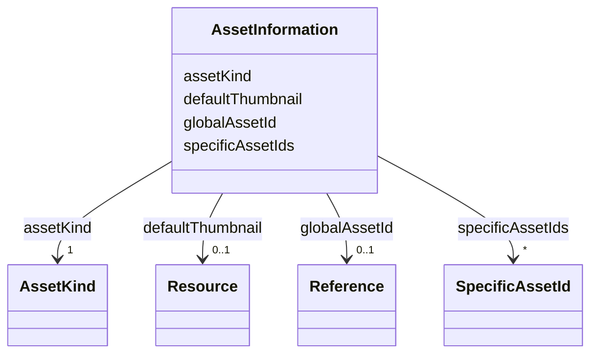

# Class: AssetInformation 


_In 'AssetInformation' identifying meta data of the asset that is represented by an AAS is defined._


URI: [aas:AssetInformation](https://admin-shell.io/aas/3/0/RC02/AssetInformation)





<!-- no inheritance hierarchy -->


## Slots

| Name | Cardinality and Range | Description | Inheritance |
| ---  | --- | --- | --- |
| [assetKind](assetKind.md) | 1 <br/> [AssetKind](AssetKind.md) | Denotes whether the Asset is of kind 'Type' or 'Instance' | direct |
| [defaultThumbnail](defaultThumbnail.md) | 0..1 <br/> [Resource](Resource.md) | Thumbnail of the asset represented by the Asset Administration Shell | direct |
| [globalAssetId](globalAssetId.md) | 0..1 <br/> [Reference](Reference.md) | Global identifier of the asset the AAS is representing | direct |
| [specificAssetIds](specificAssetIds.md) | * <br/> [SpecificAssetId](SpecificAssetId.md) | Additional domain-specific, typically proprietary identifier for the asset li... | direct |


## Usages

| used by | used in | type | used |
| ---  | --- | --- | --- |
| [AssetAdministrationShell](AssetAdministrationShell.md) | [assetInformation](assetInformation.md) | range | [AssetInformation](AssetInformation.md) |


## Identifier and Mapping Information


### Schema Source


* from schema: https://admin-shell.io/aas/3/0/RC02


## Mappings

| Mapping Type | Mapped Value |
| ---  | ---  |
| self | aas:AssetInformation |
| native | aas:AssetInformation |


## LinkML Source

<!-- TODO: investigate https://stackoverflow.com/questions/37606292/how-to-create-tabbed-code-blocks-in-mkdocs-or-sphinx -->

### Direct

<details>
```yaml
name: AssetInformation
description: In 'AssetInformation' identifying meta data of the asset that is represented
  by an AAS is defined.
from_schema: https://admin-shell.io/aas/3/0/RC02
attributes:
  assetKind:
    name: assetKind
    description: Denotes whether the Asset is of kind 'Type' or 'Instance'.
    from_schema: https://admin-shell.io/aas/3/0/RC02
    rank: 1000
    domain_of:
    - AssetInformation
    range: AssetKind
    required: true
  defaultThumbnail:
    name: defaultThumbnail
    description: Thumbnail of the asset represented by the Asset Administration Shell.
    from_schema: https://admin-shell.io/aas/3/0/RC02
    rank: 1000
    domain_of:
    - AssetInformation
    range: Resource
  globalAssetId:
    name: globalAssetId
    description: Global identifier of the asset the AAS is representing.
    from_schema: https://admin-shell.io/aas/3/0/RC02
    rank: 1000
    domain_of:
    - AssetInformation
    - Entity
    range: Reference
  specificAssetIds:
    name: specificAssetIds
    description: Additional domain-specific, typically proprietary identifier for
      the asset like e.g., serial number etc.
    from_schema: https://admin-shell.io/aas/3/0/RC02
    rank: 1000
    domain_of:
    - AssetInformation
    range: SpecificAssetId
    multivalued: true

```
</details>

### Induced

<details>
```yaml
name: AssetInformation
description: In 'AssetInformation' identifying meta data of the asset that is represented
  by an AAS is defined.
from_schema: https://admin-shell.io/aas/3/0/RC02
attributes:
  assetKind:
    name: assetKind
    description: Denotes whether the Asset is of kind 'Type' or 'Instance'.
    from_schema: https://admin-shell.io/aas/3/0/RC02
    rank: 1000
    alias: assetKind
    owner: AssetInformation
    domain_of:
    - AssetInformation
    range: AssetKind
    required: true
  defaultThumbnail:
    name: defaultThumbnail
    description: Thumbnail of the asset represented by the Asset Administration Shell.
    from_schema: https://admin-shell.io/aas/3/0/RC02
    rank: 1000
    alias: defaultThumbnail
    owner: AssetInformation
    domain_of:
    - AssetInformation
    range: Resource
  globalAssetId:
    name: globalAssetId
    description: Global identifier of the asset the AAS is representing.
    from_schema: https://admin-shell.io/aas/3/0/RC02
    rank: 1000
    alias: globalAssetId
    owner: AssetInformation
    domain_of:
    - AssetInformation
    - Entity
    range: Reference
  specificAssetIds:
    name: specificAssetIds
    description: Additional domain-specific, typically proprietary identifier for
      the asset like e.g., serial number etc.
    from_schema: https://admin-shell.io/aas/3/0/RC02
    rank: 1000
    alias: specificAssetIds
    owner: AssetInformation
    domain_of:
    - AssetInformation
    range: SpecificAssetId
    multivalued: true

```
</details>