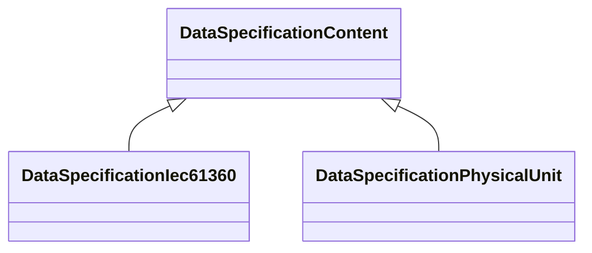

# Class: DataSpecificationContent 


_Data specification content is part of a data specification template and defines which additional attributes shall be added to the element instance that references the data specification template and meta information about the template itself._


* __NOTE__: this is an abstract class and should not be instantiated directly


URI: [aas:DataSpecificationContent](https://admin-shell.io/aas/3/0/RC02/DataSpecificationContent)





## Inheritance
* **DataSpecificationContent**
    * [DataSpecificationIec61360](DataSpecificationIec61360.md)
    * [DataSpecificationPhysicalUnit](DataSpecificationPhysicalUnit.md)


## Slots

| Name | Cardinality and Range | Description | Inheritance |
| ---  | --- | --- | --- |


## Usages

| used by | used in | type | used |
| ---  | --- | --- | --- |
| [EmbeddedDataSpecification](EmbeddedDataSpecification.md) | [dataSpecificationContent](dataSpecificationContent.md) | range | [DataSpecificationContent](DataSpecificationContent.md) |


## Identifier and Mapping Information


### Schema Source


* from schema: https://admin-shell.io/aas/3/0/RC02


## Mappings

| Mapping Type | Mapped Value |
| ---  | ---  |
| self | aas:DataSpecificationContent |
| native | aas:DataSpecificationContent |


## LinkML Source

<!-- TODO: investigate https://stackoverflow.com/questions/37606292/how-to-create-tabbed-code-blocks-in-mkdocs-or-sphinx -->

### Direct

<details>
```yaml
name: DataSpecificationContent
description: Data specification content is part of a data specification template and
  defines which additional attributes shall be added to the element instance that
  references the data specification template and meta information about the template
  itself.
from_schema: https://admin-shell.io/aas/3/0/RC02
abstract: true

```
</details>

### Induced

<details>
```yaml
name: DataSpecificationContent
description: Data specification content is part of a data specification template and
  defines which additional attributes shall be added to the element instance that
  references the data specification template and meta information about the template
  itself.
from_schema: https://admin-shell.io/aas/3/0/RC02
abstract: true

```
</details>