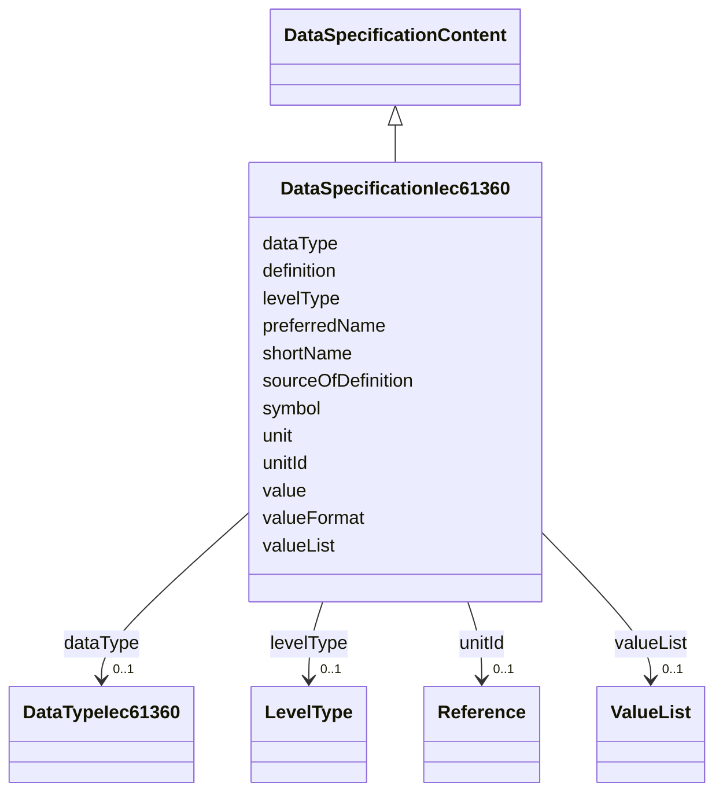

# Class: DataSpecificationIec61360 


_Content of data specification template for concept descriptions for properties, values and value lists conformant to IEC 61360._


URI: [aas:DataSpecificationIec61360](https://admin-shell.io/aas/3/0/RC02/DataSpecificationIec61360)





## Inheritance
* [DataSpecificationContent](DataSpecificationContent.md)
    * **DataSpecificationIec61360**


## Slots

| Name | Cardinality and Range | Description | Inheritance |
| ---  | --- | --- | --- |
| [dataType](dataType.md) | 0..1 <br/> [DataTypeIec61360](DataTypeIec61360.md) | Data Type | direct |
| [definition](definition.md) | * <br/> [LangString](LangString.md) | Definition in different languages | direct |
| [levelType](levelType.md) | 0..1 <br/> [LevelType](LevelType.md) | Set of levels | direct |
| [preferredName](preferredName.md) | 1..* <br/> [LangString](LangString.md) | Preferred name | direct |
| [shortName](shortName.md) | * <br/> [LangString](LangString.md) | Short name | direct |
| [sourceOfDefinition](sourceOfDefinition.md) | 0..1 <br/> [String](String.md) | Source of definition | direct |
| [symbol](symbol.md) | 0..1 <br/> [String](String.md) | Symbol | direct |
| [unit](unit.md) | 0..1 <br/> [String](String.md) | Unit | direct |
| [unitId](unitId.md) | 0..1 <br/> [Reference](Reference.md) | Unique unit id | direct |
| [value](value.md) | 0..1 <br/> [String](String.md) | Value | direct |
| [valueFormat](valueFormat.md) | 0..1 <br/> [String](String.md) | Value Format | direct |
| [valueList](valueList.md) | 0..1 <br/> [ValueList](ValueList.md) | List of allowed values | direct |


## Identifier and Mapping Information


### Schema Source


* from schema: https://admin-shell.io/aas/3/0/RC02


## Mappings

| Mapping Type | Mapped Value |
| ---  | ---  |
| self | aas:DataSpecificationIec61360 |
| native | aas:DataSpecificationIec61360 |


## LinkML Source

<!-- TODO: investigate https://stackoverflow.com/questions/37606292/how-to-create-tabbed-code-blocks-in-mkdocs-or-sphinx -->

### Direct

<details>
```yaml
name: DataSpecificationIec61360
description: Content of data specification template for concept descriptions for properties,
  values and value lists conformant to IEC 61360.
from_schema: https://admin-shell.io/aas/3/0/RC02
is_a: DataSpecificationContent
attributes:
  dataType:
    name: dataType
    description: Data Type
    from_schema: https://admin-shell.io/aas/3/0/RC02
    rank: 1000
    domain_of:
    - DataSpecificationIec61360
    range: DataTypeIec61360
  definition:
    name: definition
    description: Definition in different languages
    from_schema: https://admin-shell.io/aas/3/0/RC02
    rank: 1000
    domain_of:
    - DataSpecificationIec61360
    - DataSpecificationPhysicalUnit
    range: LangString
    multivalued: true
  levelType:
    name: levelType
    description: Set of levels.
    from_schema: https://admin-shell.io/aas/3/0/RC02
    rank: 1000
    domain_of:
    - DataSpecificationIec61360
    range: LevelType
  preferredName:
    name: preferredName
    description: Preferred name
    from_schema: https://admin-shell.io/aas/3/0/RC02
    rank: 1000
    domain_of:
    - DataSpecificationIec61360
    range: LangString
    required: true
    multivalued: true
  shortName:
    name: shortName
    description: Short name
    from_schema: https://admin-shell.io/aas/3/0/RC02
    rank: 1000
    domain_of:
    - DataSpecificationIec61360
    range: LangString
    multivalued: true
  sourceOfDefinition:
    name: sourceOfDefinition
    description: Source of definition
    from_schema: https://admin-shell.io/aas/3/0/RC02
    rank: 1000
    domain_of:
    - DataSpecificationIec61360
    - DataSpecificationPhysicalUnit
    range: string
  symbol:
    name: symbol
    description: Symbol
    from_schema: https://admin-shell.io/aas/3/0/RC02
    rank: 1000
    domain_of:
    - DataSpecificationIec61360
    range: string
  unit:
    name: unit
    description: Unit
    from_schema: https://admin-shell.io/aas/3/0/RC02
    rank: 1000
    domain_of:
    - DataSpecificationIec61360
    range: string
  unitId:
    name: unitId
    description: Unique unit id
    from_schema: https://admin-shell.io/aas/3/0/RC02
    rank: 1000
    domain_of:
    - DataSpecificationIec61360
    range: Reference
  value:
    name: value
    description: Value
    from_schema: https://admin-shell.io/aas/3/0/RC02
    domain_of:
    - Blob
    - DataSpecificationIec61360
    - Extension
    - File
    - Key
    - MultiLanguageProperty
    - OperationVariable
    - Property
    - Qualifier
    - ReferenceElement
    - SpecificAssetId
    - SubmodelElementCollection
    - SubmodelElementList
    - ValueReferencePair
    range: string
  valueFormat:
    name: valueFormat
    description: Value Format
    from_schema: https://admin-shell.io/aas/3/0/RC02
    rank: 1000
    domain_of:
    - DataSpecificationIec61360
    range: string
  valueList:
    name: valueList
    description: List of allowed values
    from_schema: https://admin-shell.io/aas/3/0/RC02
    rank: 1000
    domain_of:
    - DataSpecificationIec61360
    range: ValueList

```
</details>

### Induced

<details>
```yaml
name: DataSpecificationIec61360
description: Content of data specification template for concept descriptions for properties,
  values and value lists conformant to IEC 61360.
from_schema: https://admin-shell.io/aas/3/0/RC02
is_a: DataSpecificationContent
attributes:
  dataType:
    name: dataType
    description: Data Type
    from_schema: https://admin-shell.io/aas/3/0/RC02
    rank: 1000
    alias: dataType
    owner: DataSpecificationIec61360
    domain_of:
    - DataSpecificationIec61360
    range: DataTypeIec61360
  definition:
    name: definition
    description: Definition in different languages
    from_schema: https://admin-shell.io/aas/3/0/RC02
    rank: 1000
    alias: definition
    owner: DataSpecificationIec61360
    domain_of:
    - DataSpecificationIec61360
    - DataSpecificationPhysicalUnit
    range: LangString
    multivalued: true
  levelType:
    name: levelType
    description: Set of levels.
    from_schema: https://admin-shell.io/aas/3/0/RC02
    rank: 1000
    alias: levelType
    owner: DataSpecificationIec61360
    domain_of:
    - DataSpecificationIec61360
    range: LevelType
  preferredName:
    name: preferredName
    description: Preferred name
    from_schema: https://admin-shell.io/aas/3/0/RC02
    rank: 1000
    alias: preferredName
    owner: DataSpecificationIec61360
    domain_of:
    - DataSpecificationIec61360
    range: LangString
    required: true
    multivalued: true
  shortName:
    name: shortName
    description: Short name
    from_schema: https://admin-shell.io/aas/3/0/RC02
    rank: 1000
    alias: shortName
    owner: DataSpecificationIec61360
    domain_of:
    - DataSpecificationIec61360
    range: LangString
    multivalued: true
  sourceOfDefinition:
    name: sourceOfDefinition
    description: Source of definition
    from_schema: https://admin-shell.io/aas/3/0/RC02
    rank: 1000
    alias: sourceOfDefinition
    owner: DataSpecificationIec61360
    domain_of:
    - DataSpecificationIec61360
    - DataSpecificationPhysicalUnit
    range: string
  symbol:
    name: symbol
    description: Symbol
    from_schema: https://admin-shell.io/aas/3/0/RC02
    rank: 1000
    alias: symbol
    owner: DataSpecificationIec61360
    domain_of:
    - DataSpecificationIec61360
    range: string
  unit:
    name: unit
    description: Unit
    from_schema: https://admin-shell.io/aas/3/0/RC02
    rank: 1000
    alias: unit
    owner: DataSpecificationIec61360
    domain_of:
    - DataSpecificationIec61360
    range: string
  unitId:
    name: unitId
    description: Unique unit id
    from_schema: https://admin-shell.io/aas/3/0/RC02
    rank: 1000
    alias: unitId
    owner: DataSpecificationIec61360
    domain_of:
    - DataSpecificationIec61360
    range: Reference
  value:
    name: value
    description: Value
    from_schema: https://admin-shell.io/aas/3/0/RC02
    alias: value
    owner: DataSpecificationIec61360
    domain_of:
    - Blob
    - DataSpecificationIec61360
    - Extension
    - File
    - Key
    - MultiLanguageProperty
    - OperationVariable
    - Property
    - Qualifier
    - ReferenceElement
    - SpecificAssetId
    - SubmodelElementCollection
    - SubmodelElementList
    - ValueReferencePair
    range: string
  valueFormat:
    name: valueFormat
    description: Value Format
    from_schema: https://admin-shell.io/aas/3/0/RC02
    rank: 1000
    alias: valueFormat
    owner: DataSpecificationIec61360
    domain_of:
    - DataSpecificationIec61360
    range: string
  valueList:
    name: valueList
    description: List of allowed values
    from_schema: https://admin-shell.io/aas/3/0/RC02
    rank: 1000
    alias: valueList
    owner: DataSpecificationIec61360
    domain_of:
    - DataSpecificationIec61360
    range: ValueList

```
</details>