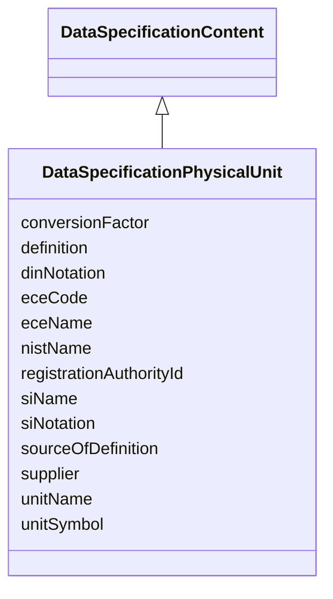

# Class: DataSpecificationPhysicalUnit 


URI: [aas:DataSpecificationPhysicalUnit](https://admin-shell.io/aas/3/0/RC02/DataSpecificationPhysicalUnit)





## Inheritance
* [DataSpecificationContent](DataSpecificationContent.md)
    * **DataSpecificationPhysicalUnit**


## Slots

| Name | Cardinality and Range | Description | Inheritance |
| ---  | --- | --- | --- |
| [conversionFactor](conversionFactor.md) | 0..1 <br/> [String](String.md) | Conversion factor | direct |
| [definition](definition.md) | 1..* <br/> [LangString](LangString.md) | Definition in different languages | direct |
| [dinNotation](dinNotation.md) | 0..1 <br/> [String](String.md) | Notation of physical unit conformant to DIN | direct |
| [eceCode](eceCode.md) | 0..1 <br/> [String](String.md) | Code of physical unit conformant to ECE | direct |
| [eceName](eceName.md) | 0..1 <br/> [String](String.md) | Name of physical unit conformant to ECE | direct |
| [nistName](nistName.md) | 0..1 <br/> [String](String.md) | Name of NIST physical unit | direct |
| [registrationAuthorityId](registrationAuthorityId.md) | 0..1 <br/> [String](String.md) | Registration authority ID | direct |
| [siName](siName.md) | 0..1 <br/> [String](String.md) | Name of SI physical unit | direct |
| [siNotation](siNotation.md) | 0..1 <br/> [String](String.md) | Notation of SI physical unit | direct |
| [sourceOfDefinition](sourceOfDefinition.md) | 0..1 <br/> [String](String.md) | Source of definition | direct |
| [supplier](supplier.md) | 0..1 <br/> [String](String.md) | Supplier | direct |
| [unitName](unitName.md) | 1 <br/> [String](String.md) | Name of the physical unit | direct |
| [unitSymbol](unitSymbol.md) | 1 <br/> [String](String.md) | Symbol for the physical unit | direct |


## Identifier and Mapping Information


### Schema Source


* from schema: https://admin-shell.io/aas/3/0/RC02


## Mappings

| Mapping Type | Mapped Value |
| ---  | ---  |
| self | aas:DataSpecificationPhysicalUnit |
| native | aas:DataSpecificationPhysicalUnit |


## LinkML Source

<!-- TODO: investigate https://stackoverflow.com/questions/37606292/how-to-create-tabbed-code-blocks-in-mkdocs-or-sphinx -->

### Direct

<details>
```yaml
name: DataSpecificationPhysicalUnit
from_schema: https://admin-shell.io/aas/3/0/RC02
is_a: DataSpecificationContent
attributes:
  conversionFactor:
    name: conversionFactor
    description: Conversion factor
    from_schema: https://admin-shell.io/aas/3/0/RC02
    rank: 1000
    domain_of:
    - DataSpecificationPhysicalUnit
    range: string
  definition:
    name: definition
    description: Definition in different languages
    from_schema: https://admin-shell.io/aas/3/0/RC02
    domain_of:
    - DataSpecificationIec61360
    - DataSpecificationPhysicalUnit
    range: LangString
    required: true
    multivalued: true
  dinNotation:
    name: dinNotation
    description: Notation of physical unit conformant to DIN
    from_schema: https://admin-shell.io/aas/3/0/RC02
    rank: 1000
    domain_of:
    - DataSpecificationPhysicalUnit
    range: string
  eceCode:
    name: eceCode
    description: Code of physical unit conformant to ECE
    from_schema: https://admin-shell.io/aas/3/0/RC02
    rank: 1000
    domain_of:
    - DataSpecificationPhysicalUnit
    range: string
  eceName:
    name: eceName
    description: Name of physical unit conformant to ECE
    from_schema: https://admin-shell.io/aas/3/0/RC02
    rank: 1000
    domain_of:
    - DataSpecificationPhysicalUnit
    range: string
  nistName:
    name: nistName
    description: Name of NIST physical unit
    from_schema: https://admin-shell.io/aas/3/0/RC02
    rank: 1000
    domain_of:
    - DataSpecificationPhysicalUnit
    range: string
  registrationAuthorityId:
    name: registrationAuthorityId
    description: Registration authority ID
    from_schema: https://admin-shell.io/aas/3/0/RC02
    rank: 1000
    domain_of:
    - DataSpecificationPhysicalUnit
    range: string
  siName:
    name: siName
    description: Name of SI physical unit
    from_schema: https://admin-shell.io/aas/3/0/RC02
    rank: 1000
    domain_of:
    - DataSpecificationPhysicalUnit
    range: string
  siNotation:
    name: siNotation
    description: Notation of SI physical unit
    from_schema: https://admin-shell.io/aas/3/0/RC02
    rank: 1000
    domain_of:
    - DataSpecificationPhysicalUnit
    range: string
  sourceOfDefinition:
    name: sourceOfDefinition
    description: Source of definition
    from_schema: https://admin-shell.io/aas/3/0/RC02
    domain_of:
    - DataSpecificationIec61360
    - DataSpecificationPhysicalUnit
    range: string
  supplier:
    name: supplier
    description: Supplier
    from_schema: https://admin-shell.io/aas/3/0/RC02
    rank: 1000
    domain_of:
    - DataSpecificationPhysicalUnit
    range: string
  unitName:
    name: unitName
    description: Name of the physical unit
    from_schema: https://admin-shell.io/aas/3/0/RC02
    rank: 1000
    domain_of:
    - DataSpecificationPhysicalUnit
    range: string
    required: true
  unitSymbol:
    name: unitSymbol
    description: Symbol for the physical unit
    from_schema: https://admin-shell.io/aas/3/0/RC02
    rank: 1000
    domain_of:
    - DataSpecificationPhysicalUnit
    range: string
    required: true

```
</details>

### Induced

<details>
```yaml
name: DataSpecificationPhysicalUnit
from_schema: https://admin-shell.io/aas/3/0/RC02
is_a: DataSpecificationContent
attributes:
  conversionFactor:
    name: conversionFactor
    description: Conversion factor
    from_schema: https://admin-shell.io/aas/3/0/RC02
    rank: 1000
    alias: conversionFactor
    owner: DataSpecificationPhysicalUnit
    domain_of:
    - DataSpecificationPhysicalUnit
    range: string
  definition:
    name: definition
    description: Definition in different languages
    from_schema: https://admin-shell.io/aas/3/0/RC02
    alias: definition
    owner: DataSpecificationPhysicalUnit
    domain_of:
    - DataSpecificationIec61360
    - DataSpecificationPhysicalUnit
    range: LangString
    required: true
    multivalued: true
  dinNotation:
    name: dinNotation
    description: Notation of physical unit conformant to DIN
    from_schema: https://admin-shell.io/aas/3/0/RC02
    rank: 1000
    alias: dinNotation
    owner: DataSpecificationPhysicalUnit
    domain_of:
    - DataSpecificationPhysicalUnit
    range: string
  eceCode:
    name: eceCode
    description: Code of physical unit conformant to ECE
    from_schema: https://admin-shell.io/aas/3/0/RC02
    rank: 1000
    alias: eceCode
    owner: DataSpecificationPhysicalUnit
    domain_of:
    - DataSpecificationPhysicalUnit
    range: string
  eceName:
    name: eceName
    description: Name of physical unit conformant to ECE
    from_schema: https://admin-shell.io/aas/3/0/RC02
    rank: 1000
    alias: eceName
    owner: DataSpecificationPhysicalUnit
    domain_of:
    - DataSpecificationPhysicalUnit
    range: string
  nistName:
    name: nistName
    description: Name of NIST physical unit
    from_schema: https://admin-shell.io/aas/3/0/RC02
    rank: 1000
    alias: nistName
    owner: DataSpecificationPhysicalUnit
    domain_of:
    - DataSpecificationPhysicalUnit
    range: string
  registrationAuthorityId:
    name: registrationAuthorityId
    description: Registration authority ID
    from_schema: https://admin-shell.io/aas/3/0/RC02
    rank: 1000
    alias: registrationAuthorityId
    owner: DataSpecificationPhysicalUnit
    domain_of:
    - DataSpecificationPhysicalUnit
    range: string
  siName:
    name: siName
    description: Name of SI physical unit
    from_schema: https://admin-shell.io/aas/3/0/RC02
    rank: 1000
    alias: siName
    owner: DataSpecificationPhysicalUnit
    domain_of:
    - DataSpecificationPhysicalUnit
    range: string
  siNotation:
    name: siNotation
    description: Notation of SI physical unit
    from_schema: https://admin-shell.io/aas/3/0/RC02
    rank: 1000
    alias: siNotation
    owner: DataSpecificationPhysicalUnit
    domain_of:
    - DataSpecificationPhysicalUnit
    range: string
  sourceOfDefinition:
    name: sourceOfDefinition
    description: Source of definition
    from_schema: https://admin-shell.io/aas/3/0/RC02
    alias: sourceOfDefinition
    owner: DataSpecificationPhysicalUnit
    domain_of:
    - DataSpecificationIec61360
    - DataSpecificationPhysicalUnit
    range: string
  supplier:
    name: supplier
    description: Supplier
    from_schema: https://admin-shell.io/aas/3/0/RC02
    rank: 1000
    alias: supplier
    owner: DataSpecificationPhysicalUnit
    domain_of:
    - DataSpecificationPhysicalUnit
    range: string
  unitName:
    name: unitName
    description: Name of the physical unit
    from_schema: https://admin-shell.io/aas/3/0/RC02
    rank: 1000
    alias: unitName
    owner: DataSpecificationPhysicalUnit
    domain_of:
    - DataSpecificationPhysicalUnit
    range: string
    required: true
  unitSymbol:
    name: unitSymbol
    description: Symbol for the physical unit
    from_schema: https://admin-shell.io/aas/3/0/RC02
    rank: 1000
    alias: unitSymbol
    owner: DataSpecificationPhysicalUnit
    domain_of:
    - DataSpecificationPhysicalUnit
    range: string
    required: true

```
</details>