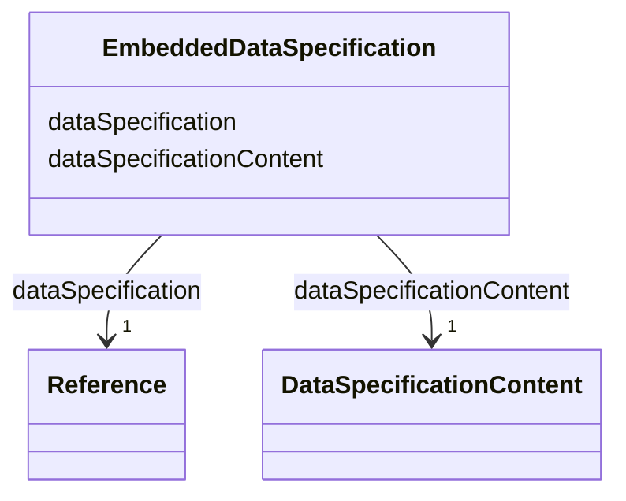

# Class: EmbeddedDataSpecification 


_Embed the content of a data specification._


URI: [aas:EmbeddedDataSpecification](https://admin-shell.io/aas/3/0/RC02/EmbeddedDataSpecification)





<!-- no inheritance hierarchy -->


## Slots

| Name | Cardinality and Range | Description | Inheritance |
| ---  | --- | --- | --- |
| [dataSpecification](dataSpecification.md) | 1 <br/> [Reference](Reference.md) | Reference to the data specification | direct |
| [dataSpecificationContent](dataSpecificationContent.md) | 1 <br/> [DataSpecificationContent](DataSpecificationContent.md) | Actual content of the data specification | direct |


## Usages

| used by | used in | type | used |
| ---  | --- | --- | --- |
| [AdministrativeInformation](AdministrativeInformation.md) | [embeddedDataSpecifications](embeddedDataSpecifications.md) | range | [EmbeddedDataSpecification](EmbeddedDataSpecification.md) |
| [AnnotatedRelationshipElement](AnnotatedRelationshipElement.md) | [embeddedDataSpecifications](embeddedDataSpecifications.md) | range | [EmbeddedDataSpecification](EmbeddedDataSpecification.md) |
| [AssetAdministrationShell](AssetAdministrationShell.md) | [embeddedDataSpecifications](embeddedDataSpecifications.md) | range | [EmbeddedDataSpecification](EmbeddedDataSpecification.md) |
| [BasicEventElement](BasicEventElement.md) | [embeddedDataSpecifications](embeddedDataSpecifications.md) | range | [EmbeddedDataSpecification](EmbeddedDataSpecification.md) |
| [Blob](Blob.md) | [embeddedDataSpecifications](embeddedDataSpecifications.md) | range | [EmbeddedDataSpecification](EmbeddedDataSpecification.md) |
| [Capability](Capability.md) | [embeddedDataSpecifications](embeddedDataSpecifications.md) | range | [EmbeddedDataSpecification](EmbeddedDataSpecification.md) |
| [ConceptDescription](ConceptDescription.md) | [embeddedDataSpecifications](embeddedDataSpecifications.md) | range | [EmbeddedDataSpecification](EmbeddedDataSpecification.md) |
| [DataElement](DataElement.md) | [embeddedDataSpecifications](embeddedDataSpecifications.md) | range | [EmbeddedDataSpecification](EmbeddedDataSpecification.md) |
| [Entity](Entity.md) | [embeddedDataSpecifications](embeddedDataSpecifications.md) | range | [EmbeddedDataSpecification](EmbeddedDataSpecification.md) |
| [EventElement](EventElement.md) | [embeddedDataSpecifications](embeddedDataSpecifications.md) | range | [EmbeddedDataSpecification](EmbeddedDataSpecification.md) |
| [File](File.md) | [embeddedDataSpecifications](embeddedDataSpecifications.md) | range | [EmbeddedDataSpecification](EmbeddedDataSpecification.md) |
| [HasDataSpecification](HasDataSpecification.md) | [embeddedDataSpecifications](embeddedDataSpecifications.md) | range | [EmbeddedDataSpecification](EmbeddedDataSpecification.md) |
| [MultiLanguageProperty](MultiLanguageProperty.md) | [embeddedDataSpecifications](embeddedDataSpecifications.md) | range | [EmbeddedDataSpecification](EmbeddedDataSpecification.md) |
| [Operation](Operation.md) | [embeddedDataSpecifications](embeddedDataSpecifications.md) | range | [EmbeddedDataSpecification](EmbeddedDataSpecification.md) |
| [Property](Property.md) | [embeddedDataSpecifications](embeddedDataSpecifications.md) | range | [EmbeddedDataSpecification](EmbeddedDataSpecification.md) |
| [Range](Range.md) | [embeddedDataSpecifications](embeddedDataSpecifications.md) | range | [EmbeddedDataSpecification](EmbeddedDataSpecification.md) |
| [ReferenceElement](ReferenceElement.md) | [embeddedDataSpecifications](embeddedDataSpecifications.md) | range | [EmbeddedDataSpecification](EmbeddedDataSpecification.md) |
| [RelationshipElement](RelationshipElement.md) | [embeddedDataSpecifications](embeddedDataSpecifications.md) | range | [EmbeddedDataSpecification](EmbeddedDataSpecification.md) |
| [Submodel](Submodel.md) | [embeddedDataSpecifications](embeddedDataSpecifications.md) | range | [EmbeddedDataSpecification](EmbeddedDataSpecification.md) |
| [SubmodelElement](SubmodelElement.md) | [embeddedDataSpecifications](embeddedDataSpecifications.md) | range | [EmbeddedDataSpecification](EmbeddedDataSpecification.md) |
| [SubmodelElementCollection](SubmodelElementCollection.md) | [embeddedDataSpecifications](embeddedDataSpecifications.md) | range | [EmbeddedDataSpecification](EmbeddedDataSpecification.md) |
| [SubmodelElementList](SubmodelElementList.md) | [embeddedDataSpecifications](embeddedDataSpecifications.md) | range | [EmbeddedDataSpecification](EmbeddedDataSpecification.md) |


## Identifier and Mapping Information


### Schema Source


* from schema: https://admin-shell.io/aas/3/0/RC02


## Mappings

| Mapping Type | Mapped Value |
| ---  | ---  |
| self | aas:EmbeddedDataSpecification |
| native | aas:EmbeddedDataSpecification |


## LinkML Source

<!-- TODO: investigate https://stackoverflow.com/questions/37606292/how-to-create-tabbed-code-blocks-in-mkdocs-or-sphinx -->

### Direct

<details>
```yaml
name: EmbeddedDataSpecification
description: Embed the content of a data specification.
from_schema: https://admin-shell.io/aas/3/0/RC02
attributes:
  dataSpecification:
    name: dataSpecification
    description: Reference to the data specification
    from_schema: https://admin-shell.io/aas/3/0/RC02
    rank: 1000
    domain_of:
    - EmbeddedDataSpecification
    range: Reference
    required: true
  dataSpecificationContent:
    name: dataSpecificationContent
    description: Actual content of the data specification
    from_schema: https://admin-shell.io/aas/3/0/RC02
    rank: 1000
    domain_of:
    - EmbeddedDataSpecification
    range: DataSpecificationContent
    required: true

```
</details>

### Induced

<details>
```yaml
name: EmbeddedDataSpecification
description: Embed the content of a data specification.
from_schema: https://admin-shell.io/aas/3/0/RC02
attributes:
  dataSpecification:
    name: dataSpecification
    description: Reference to the data specification
    from_schema: https://admin-shell.io/aas/3/0/RC02
    rank: 1000
    alias: dataSpecification
    owner: EmbeddedDataSpecification
    domain_of:
    - EmbeddedDataSpecification
    range: Reference
    required: true
  dataSpecificationContent:
    name: dataSpecificationContent
    description: Actual content of the data specification
    from_schema: https://admin-shell.io/aas/3/0/RC02
    rank: 1000
    alias: dataSpecificationContent
    owner: EmbeddedDataSpecification
    domain_of:
    - EmbeddedDataSpecification
    range: DataSpecificationContent
    required: true

```
</details>