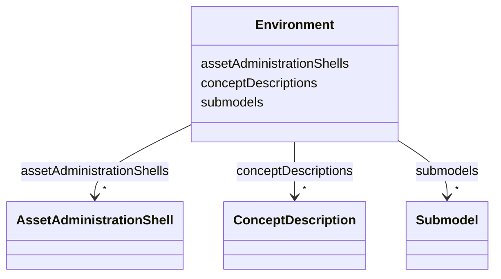

# Class: Environment 


_Container for the sets of different identifiables._


URI: [aas:Environment](https://admin-shell.io/aas/3/0/RC02/Environment)





<!-- no inheritance hierarchy -->


## Slots

| Name | Cardinality and Range | Description | Inheritance |
| ---  | --- | --- | --- |
| [assetAdministrationShells](assetAdministrationShells.md) | * <br/> [AssetAdministrationShell](AssetAdministrationShell.md) | Asset administration shell | direct |
| [conceptDescriptions](conceptDescriptions.md) | * <br/> [ConceptDescription](ConceptDescription.md) | Concept description | direct |
| [submodels](submodels.md) | * <br/> [Submodel](Submodel.md) | Submodel | direct |


## Identifier and Mapping Information


### Schema Source


* from schema: https://admin-shell.io/aas/3/0/RC02


## Mappings

| Mapping Type | Mapped Value |
| ---  | ---  |
| self | aas:Environment |
| native | aas:Environment |


## LinkML Source

<!-- TODO: investigate https://stackoverflow.com/questions/37606292/how-to-create-tabbed-code-blocks-in-mkdocs-or-sphinx -->

### Direct

<details>
```yaml
name: Environment
description: Container for the sets of different identifiables.
from_schema: https://admin-shell.io/aas/3/0/RC02
attributes:
  assetAdministrationShells:
    name: assetAdministrationShells
    description: Asset administration shell
    from_schema: https://admin-shell.io/aas/3/0/RC02
    rank: 1000
    domain_of:
    - Environment
    range: AssetAdministrationShell
    multivalued: true
  conceptDescriptions:
    name: conceptDescriptions
    description: Concept description
    from_schema: https://admin-shell.io/aas/3/0/RC02
    rank: 1000
    domain_of:
    - Environment
    range: ConceptDescription
    multivalued: true
  submodels:
    name: submodels
    description: Submodel
    from_schema: https://admin-shell.io/aas/3/0/RC02
    domain_of:
    - AssetAdministrationShell
    - Environment
    range: Submodel
    multivalued: true

```
</details>

### Induced

<details>
```yaml
name: Environment
description: Container for the sets of different identifiables.
from_schema: https://admin-shell.io/aas/3/0/RC02
attributes:
  assetAdministrationShells:
    name: assetAdministrationShells
    description: Asset administration shell
    from_schema: https://admin-shell.io/aas/3/0/RC02
    rank: 1000
    alias: assetAdministrationShells
    owner: Environment
    domain_of:
    - Environment
    range: AssetAdministrationShell
    multivalued: true
  conceptDescriptions:
    name: conceptDescriptions
    description: Concept description
    from_schema: https://admin-shell.io/aas/3/0/RC02
    rank: 1000
    alias: conceptDescriptions
    owner: Environment
    domain_of:
    - Environment
    range: ConceptDescription
    multivalued: true
  submodels:
    name: submodels
    description: Submodel
    from_schema: https://admin-shell.io/aas/3/0/RC02
    alias: submodels
    owner: Environment
    domain_of:
    - AssetAdministrationShell
    - Environment
    range: Submodel
    multivalued: true

```
</details>