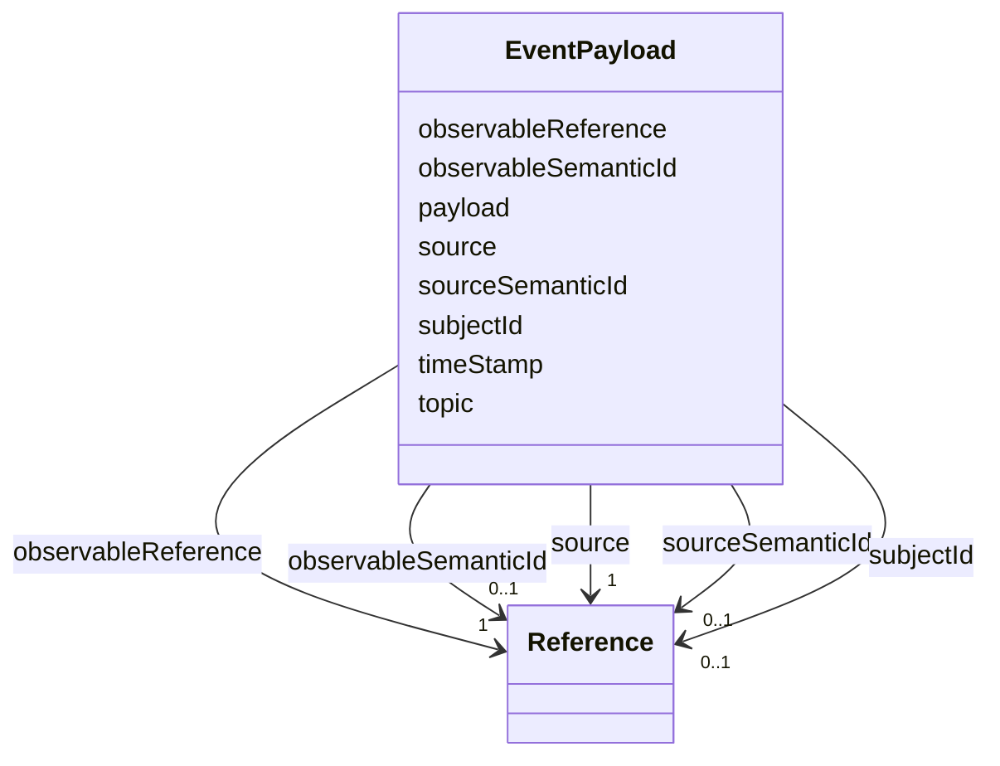

# Class: EventPayload 


_Defines the necessary information of an event instance sent out or received._


URI: [aas:EventPayload](https://admin-shell.io/aas/3/0/RC02/EventPayload)





<!-- no inheritance hierarchy -->


## Slots

| Name | Cardinality and Range | Description | Inheritance |
| ---  | --- | --- | --- |
| [observableReference](observableReference.md) | 1 <br/> [Reference](Reference.md) | Reference to the referable, which defines the scope of the event | direct |
| [observableSemanticId](observableSemanticId.md) | 0..1 <br/> [Reference](Reference.md) | 'semanticId' of the referable which defines the scope of the event, if availa... | direct |
| [payload](payload.md) | 0..1 <br/> [String](String.md) | Event specific payload | direct |
| [source](source.md) | 1 <br/> [Reference](Reference.md) | Reference to the source event element, including identification of 'AssetAdmi... | direct |
| [sourceSemanticId](sourceSemanticId.md) | 0..1 <br/> [Reference](Reference.md) | 'semanticId' of the source event element, if available | direct |
| [subjectId](subjectId.md) | 0..1 <br/> [Reference](Reference.md) | Subject, who/which initiated the creation | direct |
| [timeStamp](timeStamp.md) | 1 <br/> [String](String.md) | Timestamp in UTC, when this event was triggered | direct |
| [topic](topic.md) | 0..1 <br/> [String](String.md) | Information for the outer message infrastructure for scheduling the event to ... | direct |


## Identifier and Mapping Information


### Schema Source


* from schema: https://admin-shell.io/aas/3/0/RC02


## Mappings

| Mapping Type | Mapped Value |
| ---  | ---  |
| self | aas:EventPayload |
| native | aas:EventPayload |


## LinkML Source

<!-- TODO: investigate https://stackoverflow.com/questions/37606292/how-to-create-tabbed-code-blocks-in-mkdocs-or-sphinx -->

### Direct

<details>
```yaml
name: EventPayload
description: Defines the necessary information of an event instance sent out or received.
from_schema: https://admin-shell.io/aas/3/0/RC02
attributes:
  observableReference:
    name: observableReference
    description: Reference to the referable, which defines the scope of the event.
    from_schema: https://admin-shell.io/aas/3/0/RC02
    rank: 1000
    domain_of:
    - EventPayload
    range: Reference
    required: true
  observableSemanticId:
    name: observableSemanticId
    description: '''semanticId'' of the referable which defines the scope of the event,
      if available.'
    from_schema: https://admin-shell.io/aas/3/0/RC02
    rank: 1000
    domain_of:
    - EventPayload
    range: Reference
  payload:
    name: payload
    description: Event specific payload.
    from_schema: https://admin-shell.io/aas/3/0/RC02
    rank: 1000
    domain_of:
    - EventPayload
    range: string
  source:
    name: source
    description: Reference to the source event element, including identification of
      'AssetAdministrationShell', 'Submodel', 'SubmodelElement''s.
    from_schema: https://admin-shell.io/aas/3/0/RC02
    rank: 1000
    domain_of:
    - EventPayload
    range: Reference
    required: true
  sourceSemanticId:
    name: sourceSemanticId
    description: '''semanticId'' of the source event element, if available'
    from_schema: https://admin-shell.io/aas/3/0/RC02
    rank: 1000
    domain_of:
    - EventPayload
    range: Reference
  subjectId:
    name: subjectId
    description: Subject, who/which initiated the creation.
    from_schema: https://admin-shell.io/aas/3/0/RC02
    rank: 1000
    domain_of:
    - EventPayload
    range: Reference
  timeStamp:
    name: timeStamp
    description: Timestamp in UTC, when this event was triggered.
    from_schema: https://admin-shell.io/aas/3/0/RC02
    rank: 1000
    domain_of:
    - EventPayload
    range: string
    required: true
    pattern: ^-?(([1-9][0-9][0-9][0-9]+)|(0[0-9][0-9][0-9]))-((0[1-9])|(1[0-2]))-((0[1-9])|([12][0-9])|(3[01]))T(((([01][0-9])|(2[0-3])):[0-5][0-9]:([0-5][0-9])(\.[0-9]+)?)|24:00:00(\.0+)?)Z$
  topic:
    name: topic
    description: Information for the outer message infrastructure for scheduling the
      event to the respective communication channel.
    from_schema: https://admin-shell.io/aas/3/0/RC02
    rank: 1000
    domain_of:
    - EventPayload
    range: string

```
</details>

### Induced

<details>
```yaml
name: EventPayload
description: Defines the necessary information of an event instance sent out or received.
from_schema: https://admin-shell.io/aas/3/0/RC02
attributes:
  observableReference:
    name: observableReference
    description: Reference to the referable, which defines the scope of the event.
    from_schema: https://admin-shell.io/aas/3/0/RC02
    rank: 1000
    alias: observableReference
    owner: EventPayload
    domain_of:
    - EventPayload
    range: Reference
    required: true
  observableSemanticId:
    name: observableSemanticId
    description: '''semanticId'' of the referable which defines the scope of the event,
      if available.'
    from_schema: https://admin-shell.io/aas/3/0/RC02
    rank: 1000
    alias: observableSemanticId
    owner: EventPayload
    domain_of:
    - EventPayload
    range: Reference
  payload:
    name: payload
    description: Event specific payload.
    from_schema: https://admin-shell.io/aas/3/0/RC02
    rank: 1000
    alias: payload
    owner: EventPayload
    domain_of:
    - EventPayload
    range: string
  source:
    name: source
    description: Reference to the source event element, including identification of
      'AssetAdministrationShell', 'Submodel', 'SubmodelElement''s.
    from_schema: https://admin-shell.io/aas/3/0/RC02
    rank: 1000
    alias: source
    owner: EventPayload
    domain_of:
    - EventPayload
    range: Reference
    required: true
  sourceSemanticId:
    name: sourceSemanticId
    description: '''semanticId'' of the source event element, if available'
    from_schema: https://admin-shell.io/aas/3/0/RC02
    rank: 1000
    alias: sourceSemanticId
    owner: EventPayload
    domain_of:
    - EventPayload
    range: Reference
  subjectId:
    name: subjectId
    description: Subject, who/which initiated the creation.
    from_schema: https://admin-shell.io/aas/3/0/RC02
    rank: 1000
    alias: subjectId
    owner: EventPayload
    domain_of:
    - EventPayload
    range: Reference
  timeStamp:
    name: timeStamp
    description: Timestamp in UTC, when this event was triggered.
    from_schema: https://admin-shell.io/aas/3/0/RC02
    rank: 1000
    alias: timeStamp
    owner: EventPayload
    domain_of:
    - EventPayload
    range: string
    required: true
    pattern: ^-?(([1-9][0-9][0-9][0-9]+)|(0[0-9][0-9][0-9]))-((0[1-9])|(1[0-2]))-((0[1-9])|([12][0-9])|(3[01]))T(((([01][0-9])|(2[0-3])):[0-5][0-9]:([0-5][0-9])(\.[0-9]+)?)|24:00:00(\.0+)?)Z$
  topic:
    name: topic
    description: Information for the outer message infrastructure for scheduling the
      event to the respective communication channel.
    from_schema: https://admin-shell.io/aas/3/0/RC02
    rank: 1000
    alias: topic
    owner: EventPayload
    domain_of:
    - EventPayload
    range: string

```
</details>