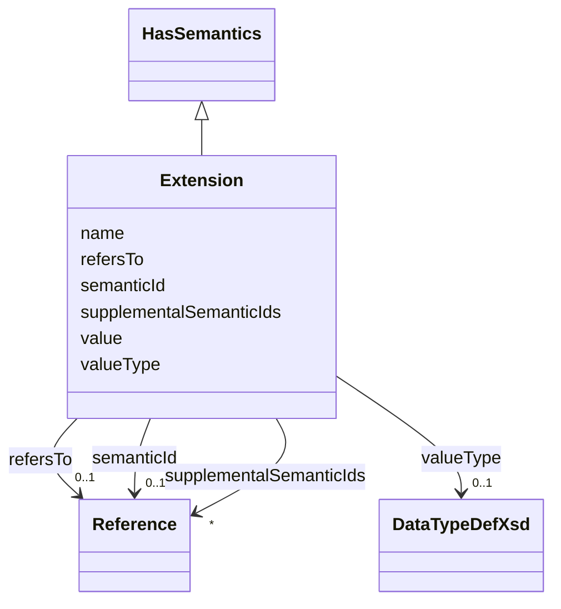

# Class: Extension 


_Single extension of an element._


URI: [aas:Extension](https://admin-shell.io/aas/3/0/RC02/Extension)





## Inheritance
* [HasSemantics](HasSemantics.md)
    * **Extension**


## Slots

| Name | Cardinality and Range | Description | Inheritance |
| ---  | --- | --- | --- |
| [name](name.md) | 1 <br/> [String](String.md) | Name of the extension | direct |
| [refersTo](refersTo.md) | 0..1 <br/> [Reference](Reference.md) | Reference to an element the extension refers to | direct |
| [value](value.md) | 0..1 <br/> [String](String.md) | Value of the extension | direct |
| [valueType](valueType.md) | 0..1 <br/> [DataTypeDefXsd](DataTypeDefXsd.md) | Type of the value of the extension | direct |
| [semanticId](semanticId.md) | 0..1 <br/> [Reference](Reference.md) | Identifier of the semantic definition of the element | [HasSemantics](HasSemantics.md) |
| [supplementalSemanticIds](supplementalSemanticIds.md) | * <br/> [Reference](Reference.md) | Identifier of a supplemental semantic definition of the element | [HasSemantics](HasSemantics.md) |


## Usages

| used by | used in | type | used |
| ---  | --- | --- | --- |
| [AnnotatedRelationshipElement](AnnotatedRelationshipElement.md) | [extensions](extensions.md) | range | [Extension](Extension.md) |
| [AssetAdministrationShell](AssetAdministrationShell.md) | [extensions](extensions.md) | range | [Extension](Extension.md) |
| [BasicEventElement](BasicEventElement.md) | [extensions](extensions.md) | range | [Extension](Extension.md) |
| [Blob](Blob.md) | [extensions](extensions.md) | range | [Extension](Extension.md) |
| [Capability](Capability.md) | [extensions](extensions.md) | range | [Extension](Extension.md) |
| [ConceptDescription](ConceptDescription.md) | [extensions](extensions.md) | range | [Extension](Extension.md) |
| [DataElement](DataElement.md) | [extensions](extensions.md) | range | [Extension](Extension.md) |
| [Entity](Entity.md) | [extensions](extensions.md) | range | [Extension](Extension.md) |
| [EventElement](EventElement.md) | [extensions](extensions.md) | range | [Extension](Extension.md) |
| [File](File.md) | [extensions](extensions.md) | range | [Extension](Extension.md) |
| [HasExtensions](HasExtensions.md) | [extensions](extensions.md) | range | [Extension](Extension.md) |
| [Identifiable](Identifiable.md) | [extensions](extensions.md) | range | [Extension](Extension.md) |
| [MultiLanguageProperty](MultiLanguageProperty.md) | [extensions](extensions.md) | range | [Extension](Extension.md) |
| [Operation](Operation.md) | [extensions](extensions.md) | range | [Extension](Extension.md) |
| [Property](Property.md) | [extensions](extensions.md) | range | [Extension](Extension.md) |
| [Range](Range.md) | [extensions](extensions.md) | range | [Extension](Extension.md) |
| [Referable](Referable.md) | [extensions](extensions.md) | range | [Extension](Extension.md) |
| [ReferenceElement](ReferenceElement.md) | [extensions](extensions.md) | range | [Extension](Extension.md) |
| [RelationshipElement](RelationshipElement.md) | [extensions](extensions.md) | range | [Extension](Extension.md) |
| [Submodel](Submodel.md) | [extensions](extensions.md) | range | [Extension](Extension.md) |
| [SubmodelElement](SubmodelElement.md) | [extensions](extensions.md) | range | [Extension](Extension.md) |
| [SubmodelElementCollection](SubmodelElementCollection.md) | [extensions](extensions.md) | range | [Extension](Extension.md) |
| [SubmodelElementList](SubmodelElementList.md) | [extensions](extensions.md) | range | [Extension](Extension.md) |


## Identifier and Mapping Information


### Schema Source


* from schema: https://admin-shell.io/aas/3/0/RC02


## Mappings

| Mapping Type | Mapped Value |
| ---  | ---  |
| self | aas:Extension |
| native | aas:Extension |


## LinkML Source

<!-- TODO: investigate https://stackoverflow.com/questions/37606292/how-to-create-tabbed-code-blocks-in-mkdocs-or-sphinx -->

### Direct

<details>
```yaml
name: Extension
description: Single extension of an element.
from_schema: https://admin-shell.io/aas/3/0/RC02
is_a: HasSemantics
attributes:
  name:
    name: name
    description: Name of the extension.
    from_schema: https://admin-shell.io/aas/3/0/RC02
    rank: 1000
    domain_of:
    - Extension
    - SpecificAssetId
    range: string
    required: true
  refersTo:
    name: refersTo
    description: Reference to an element the extension refers to.
    from_schema: https://admin-shell.io/aas/3/0/RC02
    rank: 1000
    domain_of:
    - Extension
    range: Reference
  value:
    name: value
    description: Value of the extension
    from_schema: https://admin-shell.io/aas/3/0/RC02
    domain_of:
    - Blob
    - DataSpecificationIec61360
    - Extension
    - File
    - Key
    - MultiLanguageProperty
    - OperationVariable
    - Property
    - Qualifier
    - ReferenceElement
    - SpecificAssetId
    - SubmodelElementCollection
    - SubmodelElementList
    - ValueReferencePair
    range: string
  valueType:
    name: valueType
    description: Type of the value of the extension.
    from_schema: https://admin-shell.io/aas/3/0/RC02
    rank: 1000
    domain_of:
    - Extension
    - Property
    - Qualifier
    - Range
    range: DataTypeDefXsd

```
</details>

### Induced

<details>
```yaml
name: Extension
description: Single extension of an element.
from_schema: https://admin-shell.io/aas/3/0/RC02
is_a: HasSemantics
attributes:
  name:
    name: name
    description: Name of the extension.
    from_schema: https://admin-shell.io/aas/3/0/RC02
    rank: 1000
    alias: name
    owner: Extension
    domain_of:
    - Extension
    - SpecificAssetId
    range: string
    required: true
  refersTo:
    name: refersTo
    description: Reference to an element the extension refers to.
    from_schema: https://admin-shell.io/aas/3/0/RC02
    rank: 1000
    alias: refersTo
    owner: Extension
    domain_of:
    - Extension
    range: Reference
  value:
    name: value
    description: Value of the extension
    from_schema: https://admin-shell.io/aas/3/0/RC02
    alias: value
    owner: Extension
    domain_of:
    - Blob
    - DataSpecificationIec61360
    - Extension
    - File
    - Key
    - MultiLanguageProperty
    - OperationVariable
    - Property
    - Qualifier
    - ReferenceElement
    - SpecificAssetId
    - SubmodelElementCollection
    - SubmodelElementList
    - ValueReferencePair
    range: string
  valueType:
    name: valueType
    description: Type of the value of the extension.
    from_schema: https://admin-shell.io/aas/3/0/RC02
    rank: 1000
    alias: valueType
    owner: Extension
    domain_of:
    - Extension
    - Property
    - Qualifier
    - Range
    range: DataTypeDefXsd
  semanticId:
    name: semanticId
    description: Identifier of the semantic definition of the element. It is called
      semantic ID of the element or also main semantic ID of the element.
    from_schema: https://admin-shell.io/aas/3/0/RC02
    rank: 1000
    alias: semanticId
    owner: Extension
    domain_of:
    - HasSemantics
    range: Reference
  supplementalSemanticIds:
    name: supplementalSemanticIds
    description: Identifier of a supplemental semantic definition of the element.
      It is called supplemental semantic ID of the element.
    from_schema: https://admin-shell.io/aas/3/0/RC02
    rank: 1000
    alias: supplementalSemanticIds
    owner: Extension
    domain_of:
    - HasSemantics
    range: Reference
    multivalued: true

```
</details>