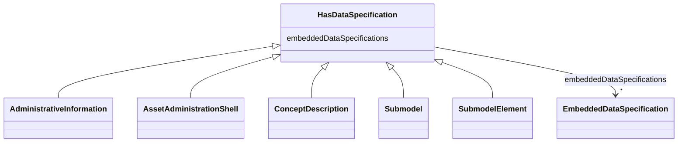

# Class: HasDataSpecification 


_Element that can be extended by using data specification templates._


* __NOTE__: this is an abstract class and should not be instantiated directly


URI: [aas:HasDataSpecification](https://admin-shell.io/aas/3/0/RC02/HasDataSpecification)





## Inheritance
* **HasDataSpecification**
    * [AdministrativeInformation](AdministrativeInformation.md)


## Slots

| Name | Cardinality and Range | Description | Inheritance |
| ---  | --- | --- | --- |
| [embeddedDataSpecifications](embeddedDataSpecifications.md) | * <br/> [EmbeddedDataSpecification](EmbeddedDataSpecification.md) | Embedded data specification | direct |


## Identifier and Mapping Information


### Schema Source


* from schema: https://admin-shell.io/aas/3/0/RC02


## Mappings

| Mapping Type | Mapped Value |
| ---  | ---  |
| self | aas:HasDataSpecification |
| native | aas:HasDataSpecification |


## LinkML Source

<!-- TODO: investigate https://stackoverflow.com/questions/37606292/how-to-create-tabbed-code-blocks-in-mkdocs-or-sphinx -->

### Direct

<details>
```yaml
name: HasDataSpecification
description: Element that can be extended by using data specification templates.
from_schema: https://admin-shell.io/aas/3/0/RC02
abstract: true
attributes:
  embeddedDataSpecifications:
    name: embeddedDataSpecifications
    description: Embedded data specification.
    from_schema: https://admin-shell.io/aas/3/0/RC02
    rank: 1000
    domain_of:
    - HasDataSpecification
    range: EmbeddedDataSpecification
    multivalued: true

```
</details>

### Induced

<details>
```yaml
name: HasDataSpecification
description: Element that can be extended by using data specification templates.
from_schema: https://admin-shell.io/aas/3/0/RC02
abstract: true
attributes:
  embeddedDataSpecifications:
    name: embeddedDataSpecifications
    description: Embedded data specification.
    from_schema: https://admin-shell.io/aas/3/0/RC02
    rank: 1000
    alias: embeddedDataSpecifications
    owner: HasDataSpecification
    domain_of:
    - HasDataSpecification
    range: EmbeddedDataSpecification
    multivalued: true

```
</details>