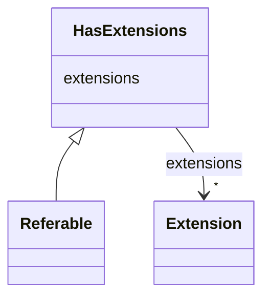

# Class: HasExtensions 


_Element that can be extended by proprietary extensions._


* __NOTE__: this is an abstract class and should not be instantiated directly


URI: [aas:HasExtensions](https://admin-shell.io/aas/3/0/RC02/HasExtensions)





## Inheritance
* **HasExtensions**
    * [Referable](Referable.md)


## Slots

| Name | Cardinality and Range | Description | Inheritance |
| ---  | --- | --- | --- |
| [extensions](extensions.md) | * <br/> [Extension](Extension.md) | An extension of the element | direct |


## Identifier and Mapping Information


### Schema Source


* from schema: https://admin-shell.io/aas/3/0/RC02


## Mappings

| Mapping Type | Mapped Value |
| ---  | ---  |
| self | aas:HasExtensions |
| native | aas:HasExtensions |


## LinkML Source

<!-- TODO: investigate https://stackoverflow.com/questions/37606292/how-to-create-tabbed-code-blocks-in-mkdocs-or-sphinx -->

### Direct

<details>
```yaml
name: HasExtensions
description: Element that can be extended by proprietary extensions.
from_schema: https://admin-shell.io/aas/3/0/RC02
abstract: true
attributes:
  extensions:
    name: extensions
    description: An extension of the element.
    from_schema: https://admin-shell.io/aas/3/0/RC02
    rank: 1000
    domain_of:
    - HasExtensions
    range: Extension
    multivalued: true

```
</details>

### Induced

<details>
```yaml
name: HasExtensions
description: Element that can be extended by proprietary extensions.
from_schema: https://admin-shell.io/aas/3/0/RC02
abstract: true
attributes:
  extensions:
    name: extensions
    description: An extension of the element.
    from_schema: https://admin-shell.io/aas/3/0/RC02
    rank: 1000
    alias: extensions
    owner: HasExtensions
    domain_of:
    - HasExtensions
    range: Extension
    multivalued: true

```
</details>