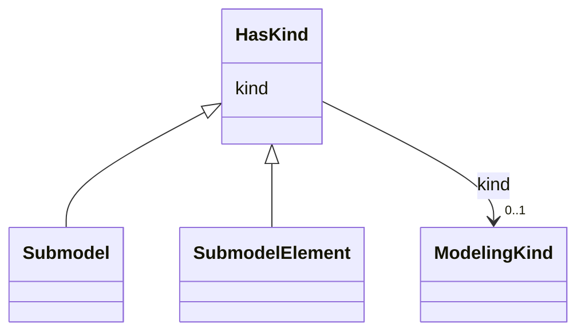

# Class: HasKind 


_An element with a kind is an element that can either represent a template or an instance._


* __NOTE__: this is an abstract class and should not be instantiated directly


URI: [aas:HasKind](https://admin-shell.io/aas/3/0/RC02/HasKind)





<!-- no inheritance hierarchy -->


## Slots

| Name | Cardinality and Range | Description | Inheritance |
| ---  | --- | --- | --- |
| [kind](kind.md) | 0..1 <br/> [ModelingKind](ModelingKind.md) | Kind of the element: either type or instance | direct |


## Identifier and Mapping Information


### Schema Source


* from schema: https://admin-shell.io/aas/3/0/RC02


## Mappings

| Mapping Type | Mapped Value |
| ---  | ---  |
| self | aas:HasKind |
| native | aas:HasKind |


## LinkML Source

<!-- TODO: investigate https://stackoverflow.com/questions/37606292/how-to-create-tabbed-code-blocks-in-mkdocs-or-sphinx -->

### Direct

<details>
```yaml
name: HasKind
description: An element with a kind is an element that can either represent a template
  or an instance.
from_schema: https://admin-shell.io/aas/3/0/RC02
abstract: true
attributes:
  kind:
    name: kind
    description: 'Kind of the element: either type or instance.'
    from_schema: https://admin-shell.io/aas/3/0/RC02
    rank: 1000
    domain_of:
    - HasKind
    - Qualifier
    range: ModelingKind

```
</details>

### Induced

<details>
```yaml
name: HasKind
description: An element with a kind is an element that can either represent a template
  or an instance.
from_schema: https://admin-shell.io/aas/3/0/RC02
abstract: true
attributes:
  kind:
    name: kind
    description: 'Kind of the element: either type or instance.'
    from_schema: https://admin-shell.io/aas/3/0/RC02
    rank: 1000
    alias: kind
    owner: HasKind
    domain_of:
    - HasKind
    - Qualifier
    range: ModelingKind

```
</details>