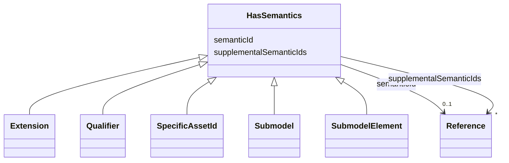

# Class: HasSemantics 


_Element that can have a semantic definition plus some supplemental semantic definitions._


* __NOTE__: this is an abstract class and should not be instantiated directly


URI: [aas:HasSemantics](https://admin-shell.io/aas/3/0/RC02/HasSemantics)





## Inheritance
* **HasSemantics**
    * [Extension](Extension.md)
    * [Qualifier](Qualifier.md)
    * [SpecificAssetId](SpecificAssetId.md)


## Slots

| Name | Cardinality and Range | Description | Inheritance |
| ---  | --- | --- | --- |
| [semanticId](semanticId.md) | 0..1 <br/> [Reference](Reference.md) | Identifier of the semantic definition of the element | direct |
| [supplementalSemanticIds](supplementalSemanticIds.md) | * <br/> [Reference](Reference.md) | Identifier of a supplemental semantic definition of the element | direct |


## Identifier and Mapping Information


### Schema Source


* from schema: https://admin-shell.io/aas/3/0/RC02


## Mappings

| Mapping Type | Mapped Value |
| ---  | ---  |
| self | aas:HasSemantics |
| native | aas:HasSemantics |


## LinkML Source

<!-- TODO: investigate https://stackoverflow.com/questions/37606292/how-to-create-tabbed-code-blocks-in-mkdocs-or-sphinx -->

### Direct

<details>
```yaml
name: HasSemantics
description: Element that can have a semantic definition plus some supplemental semantic
  definitions.
from_schema: https://admin-shell.io/aas/3/0/RC02
abstract: true
attributes:
  semanticId:
    name: semanticId
    description: Identifier of the semantic definition of the element. It is called
      semantic ID of the element or also main semantic ID of the element.
    from_schema: https://admin-shell.io/aas/3/0/RC02
    rank: 1000
    domain_of:
    - HasSemantics
    range: Reference
  supplementalSemanticIds:
    name: supplementalSemanticIds
    description: Identifier of a supplemental semantic definition of the element.
      It is called supplemental semantic ID of the element.
    from_schema: https://admin-shell.io/aas/3/0/RC02
    rank: 1000
    domain_of:
    - HasSemantics
    range: Reference
    multivalued: true

```
</details>

### Induced

<details>
```yaml
name: HasSemantics
description: Element that can have a semantic definition plus some supplemental semantic
  definitions.
from_schema: https://admin-shell.io/aas/3/0/RC02
abstract: true
attributes:
  semanticId:
    name: semanticId
    description: Identifier of the semantic definition of the element. It is called
      semantic ID of the element or also main semantic ID of the element.
    from_schema: https://admin-shell.io/aas/3/0/RC02
    rank: 1000
    alias: semanticId
    owner: HasSemantics
    domain_of:
    - HasSemantics
    range: Reference
  supplementalSemanticIds:
    name: supplementalSemanticIds
    description: Identifier of a supplemental semantic definition of the element.
      It is called supplemental semantic ID of the element.
    from_schema: https://admin-shell.io/aas/3/0/RC02
    rank: 1000
    alias: supplementalSemanticIds
    owner: HasSemantics
    domain_of:
    - HasSemantics
    range: Reference
    multivalued: true

```
</details>