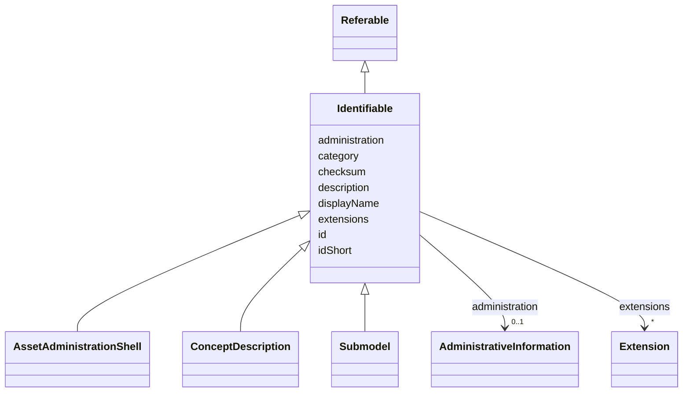

# Class: Identifiable 


_An element that has a globally unique identifier._


* __NOTE__: this is an abstract class and should not be instantiated directly


URI: [aas:Identifiable](https://admin-shell.io/aas/3/0/RC02/Identifiable)





## Inheritance
* [HasExtensions](HasExtensions.md)
    * [Referable](Referable.md)
        * **Identifiable**


## Slots

| Name | Cardinality and Range | Description | Inheritance |
| ---  | --- | --- | --- |
| [administration](administration.md) | 0..1 <br/> [AdministrativeInformation](AdministrativeInformation.md) | Administrative information of an identifiable element | direct |
| [id](id.md) | 1 <br/> [String](String.md) | The globally unique identification of the element | direct |
| [category](category.md) | 0..1 <br/> [String](String.md) | The category is a value that gives further meta information w | [Referable](Referable.md) |
| [checksum](checksum.md) | 0..1 <br/> [String](String.md) | Checksum to be used to determine if an Referable (including its aggregated ch... | [Referable](Referable.md) |
| [description](description.md) | * <br/> [LangString](LangString.md) | Description or comments on the element | [Referable](Referable.md) |
| [displayName](displayName.md) | * <br/> [LangString](LangString.md) | Display name | [Referable](Referable.md) |
| [idShort](idShort.md) | 0..1 <br/> [String](String.md) | In case of identifiables this attribute is a short name of the element | [Referable](Referable.md) |
| [extensions](extensions.md) | * <br/> [Extension](Extension.md) | An extension of the element | [HasExtensions](HasExtensions.md) |


## Identifier and Mapping Information


### Schema Source


* from schema: https://admin-shell.io/aas/3/0/RC02


## Mappings

| Mapping Type | Mapped Value |
| ---  | ---  |
| self | aas:Identifiable |
| native | aas:Identifiable |


## LinkML Source

<!-- TODO: investigate https://stackoverflow.com/questions/37606292/how-to-create-tabbed-code-blocks-in-mkdocs-or-sphinx -->

### Direct

<details>
```yaml
name: Identifiable
description: An element that has a globally unique identifier.
from_schema: https://admin-shell.io/aas/3/0/RC02
is_a: Referable
abstract: true
attributes:
  administration:
    name: administration
    description: Administrative information of an identifiable element.
    from_schema: https://admin-shell.io/aas/3/0/RC02
    rank: 1000
    domain_of:
    - Identifiable
    range: AdministrativeInformation
  id:
    name: id
    description: The globally unique identification of the element.
    from_schema: https://admin-shell.io/aas/3/0/RC02
    rank: 1000
    domain_of:
    - Identifiable
    range: string
    required: true

```
</details>

### Induced

<details>
```yaml
name: Identifiable
description: An element that has a globally unique identifier.
from_schema: https://admin-shell.io/aas/3/0/RC02
is_a: Referable
abstract: true
attributes:
  administration:
    name: administration
    description: Administrative information of an identifiable element.
    from_schema: https://admin-shell.io/aas/3/0/RC02
    rank: 1000
    alias: administration
    owner: Identifiable
    domain_of:
    - Identifiable
    range: AdministrativeInformation
  id:
    name: id
    description: The globally unique identification of the element.
    from_schema: https://admin-shell.io/aas/3/0/RC02
    rank: 1000
    alias: id
    owner: Identifiable
    domain_of:
    - Identifiable
    range: string
    required: true
  category:
    name: category
    description: The category is a value that gives further meta information w.r.t.
      to the class of the element. It affects the expected existence of attributes
      and the applicability of constraints.
    from_schema: https://admin-shell.io/aas/3/0/RC02
    rank: 1000
    alias: category
    owner: Identifiable
    domain_of:
    - Referable
    range: string
  checksum:
    name: checksum
    description: Checksum to be used to determine if an Referable (including its aggregated
      child elements) has changed.
    from_schema: https://admin-shell.io/aas/3/0/RC02
    rank: 1000
    alias: checksum
    owner: Identifiable
    domain_of:
    - Referable
    range: string
  description:
    name: description
    description: Description or comments on the element.
    from_schema: https://admin-shell.io/aas/3/0/RC02
    rank: 1000
    alias: description
    owner: Identifiable
    domain_of:
    - Referable
    range: LangString
    multivalued: true
  displayName:
    name: displayName
    description: Display name. Can be provided in several languages.
    from_schema: https://admin-shell.io/aas/3/0/RC02
    rank: 1000
    alias: displayName
    owner: Identifiable
    domain_of:
    - Referable
    range: LangString
    multivalued: true
  idShort:
    name: idShort
    description: In case of identifiables this attribute is a short name of the element.
      In case of referable this ID is an identifying string of the element within
      its name space.
    from_schema: https://admin-shell.io/aas/3/0/RC02
    rank: 1000
    alias: idShort
    owner: Identifiable
    domain_of:
    - Referable
    range: string
    pattern: ^[a-zA-Z][a-zA-Z0-9_]+$
  extensions:
    name: extensions
    description: An extension of the element.
    from_schema: https://admin-shell.io/aas/3/0/RC02
    rank: 1000
    alias: extensions
    owner: Identifiable
    domain_of:
    - HasExtensions
    range: Extension
    multivalued: true

```
</details>