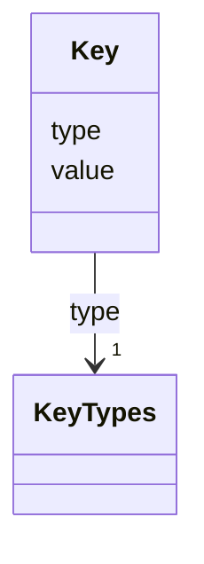

# Class: Key 


_A key is a reference to an element by its ID._


URI: [aas:Key](https://admin-shell.io/aas/3/0/RC02/Key)





<!-- no inheritance hierarchy -->


## Slots

| Name | Cardinality and Range | Description | Inheritance |
| ---  | --- | --- | --- |
| [type](type.md) | 1 <br/> [KeyTypes](KeyTypes.md) | Denotes which kind of entity is referenced | direct |
| [value](value.md) | 1 <br/> [String](String.md) | The key value, for example an IRDI or an URI | direct |


## Usages

| used by | used in | type | used |
| ---  | --- | --- | --- |
| [Reference](Reference.md) | [keys](keys.md) | range | [Key](Key.md) |


## Identifier and Mapping Information


### Schema Source


* from schema: https://admin-shell.io/aas/3/0/RC02


## Mappings

| Mapping Type | Mapped Value |
| ---  | ---  |
| self | aas:Key |
| native | aas:Key |


## LinkML Source

<!-- TODO: investigate https://stackoverflow.com/questions/37606292/how-to-create-tabbed-code-blocks-in-mkdocs-or-sphinx -->

### Direct

<details>
```yaml
name: Key
description: A key is a reference to an element by its ID.
from_schema: https://admin-shell.io/aas/3/0/RC02
attributes:
  type:
    name: type
    description: Denotes which kind of entity is referenced.
    from_schema: https://admin-shell.io/aas/3/0/RC02
    rank: 1000
    domain_of:
    - Key
    - Qualifier
    - Reference
    range: KeyTypes
    required: true
  value:
    name: value
    description: The key value, for example an IRDI or an URI
    from_schema: https://admin-shell.io/aas/3/0/RC02
    domain_of:
    - Blob
    - DataSpecificationIec61360
    - Extension
    - File
    - Key
    - MultiLanguageProperty
    - OperationVariable
    - Property
    - Qualifier
    - ReferenceElement
    - SpecificAssetId
    - SubmodelElementCollection
    - SubmodelElementList
    - ValueReferencePair
    range: string
    required: true

```
</details>

### Induced

<details>
```yaml
name: Key
description: A key is a reference to an element by its ID.
from_schema: https://admin-shell.io/aas/3/0/RC02
attributes:
  type:
    name: type
    description: Denotes which kind of entity is referenced.
    from_schema: https://admin-shell.io/aas/3/0/RC02
    rank: 1000
    alias: type
    owner: Key
    domain_of:
    - Key
    - Qualifier
    - Reference
    range: KeyTypes
    required: true
  value:
    name: value
    description: The key value, for example an IRDI or an URI
    from_schema: https://admin-shell.io/aas/3/0/RC02
    alias: value
    owner: Key
    domain_of:
    - Blob
    - DataSpecificationIec61360
    - Extension
    - File
    - Key
    - MultiLanguageProperty
    - OperationVariable
    - Property
    - Qualifier
    - ReferenceElement
    - SpecificAssetId
    - SubmodelElementCollection
    - SubmodelElementList
    - ValueReferencePair
    range: string
    required: true

```
</details>