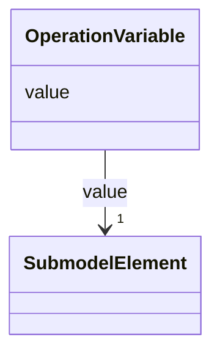

# Class: OperationVariable 


_The value of an operation variable is a submodel element that is used as input and/or output variable of an operation._


URI: [aas:OperationVariable](https://admin-shell.io/aas/3/0/RC02/OperationVariable)





<!-- no inheritance hierarchy -->


## Slots

| Name | Cardinality and Range | Description | Inheritance |
| ---  | --- | --- | --- |
| [value](value.md) | 1 <br/> [SubmodelElement](SubmodelElement.md) | Describes an argument or result of an operation via a submodel element | direct |


## Usages

| used by | used in | type | used |
| ---  | --- | --- | --- |
| [Operation](Operation.md) | [inoutputVariables](inoutputVariables.md) | range | [OperationVariable](OperationVariable.md) |
| [Operation](Operation.md) | [inputVariables](inputVariables.md) | range | [OperationVariable](OperationVariable.md) |
| [Operation](Operation.md) | [outputVariables](outputVariables.md) | range | [OperationVariable](OperationVariable.md) |


## Identifier and Mapping Information


### Schema Source


* from schema: https://admin-shell.io/aas/3/0/RC02


## Mappings

| Mapping Type | Mapped Value |
| ---  | ---  |
| self | aas:OperationVariable |
| native | aas:OperationVariable |


## LinkML Source

<!-- TODO: investigate https://stackoverflow.com/questions/37606292/how-to-create-tabbed-code-blocks-in-mkdocs-or-sphinx -->

### Direct

<details>
```yaml
name: OperationVariable
description: The value of an operation variable is a submodel element that is used
  as input and/or output variable of an operation.
from_schema: https://admin-shell.io/aas/3/0/RC02
attributes:
  value:
    name: value
    description: Describes an argument or result of an operation via a submodel element
    from_schema: https://admin-shell.io/aas/3/0/RC02
    domain_of:
    - Blob
    - DataSpecificationIec61360
    - Extension
    - File
    - Key
    - MultiLanguageProperty
    - OperationVariable
    - Property
    - Qualifier
    - ReferenceElement
    - SpecificAssetId
    - SubmodelElementCollection
    - SubmodelElementList
    - ValueReferencePair
    range: SubmodelElement
    required: true

```
</details>

### Induced

<details>
```yaml
name: OperationVariable
description: The value of an operation variable is a submodel element that is used
  as input and/or output variable of an operation.
from_schema: https://admin-shell.io/aas/3/0/RC02
attributes:
  value:
    name: value
    description: Describes an argument or result of an operation via a submodel element
    from_schema: https://admin-shell.io/aas/3/0/RC02
    alias: value
    owner: OperationVariable
    domain_of:
    - Blob
    - DataSpecificationIec61360
    - Extension
    - File
    - Key
    - MultiLanguageProperty
    - OperationVariable
    - Property
    - Qualifier
    - ReferenceElement
    - SpecificAssetId
    - SubmodelElementCollection
    - SubmodelElementList
    - ValueReferencePair
    range: SubmodelElement
    required: true

```
</details>