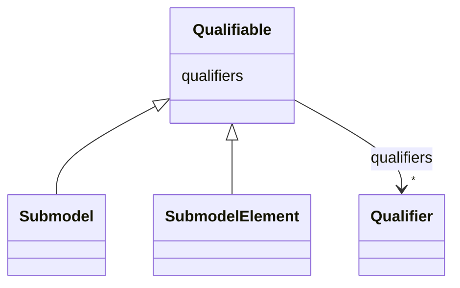

# Class: Qualifiable 


_The value of a qualifiable element may be further qualified by one or more qualifiers._


* __NOTE__: this is an abstract class and should not be instantiated directly


URI: [aas:Qualifiable](https://admin-shell.io/aas/3/0/RC02/Qualifiable)





<!-- no inheritance hierarchy -->


## Slots

| Name | Cardinality and Range | Description | Inheritance |
| ---  | --- | --- | --- |
| [qualifiers](qualifiers.md) | * <br/> [Qualifier](Qualifier.md) | Additional qualification of a qualifiable element | direct |


## Identifier and Mapping Information


### Schema Source


* from schema: https://admin-shell.io/aas/3/0/RC02


## Mappings

| Mapping Type | Mapped Value |
| ---  | ---  |
| self | aas:Qualifiable |
| native | aas:Qualifiable |


## LinkML Source

<!-- TODO: investigate https://stackoverflow.com/questions/37606292/how-to-create-tabbed-code-blocks-in-mkdocs-or-sphinx -->

### Direct

<details>
```yaml
name: Qualifiable
description: The value of a qualifiable element may be further qualified by one or
  more qualifiers.
from_schema: https://admin-shell.io/aas/3/0/RC02
abstract: true
attributes:
  qualifiers:
    name: qualifiers
    description: Additional qualification of a qualifiable element.
    from_schema: https://admin-shell.io/aas/3/0/RC02
    rank: 1000
    domain_of:
    - Qualifiable
    range: Qualifier
    multivalued: true

```
</details>

### Induced

<details>
```yaml
name: Qualifiable
description: The value of a qualifiable element may be further qualified by one or
  more qualifiers.
from_schema: https://admin-shell.io/aas/3/0/RC02
abstract: true
attributes:
  qualifiers:
    name: qualifiers
    description: Additional qualification of a qualifiable element.
    from_schema: https://admin-shell.io/aas/3/0/RC02
    rank: 1000
    alias: qualifiers
    owner: Qualifiable
    domain_of:
    - Qualifiable
    range: Qualifier
    multivalued: true

```
</details>