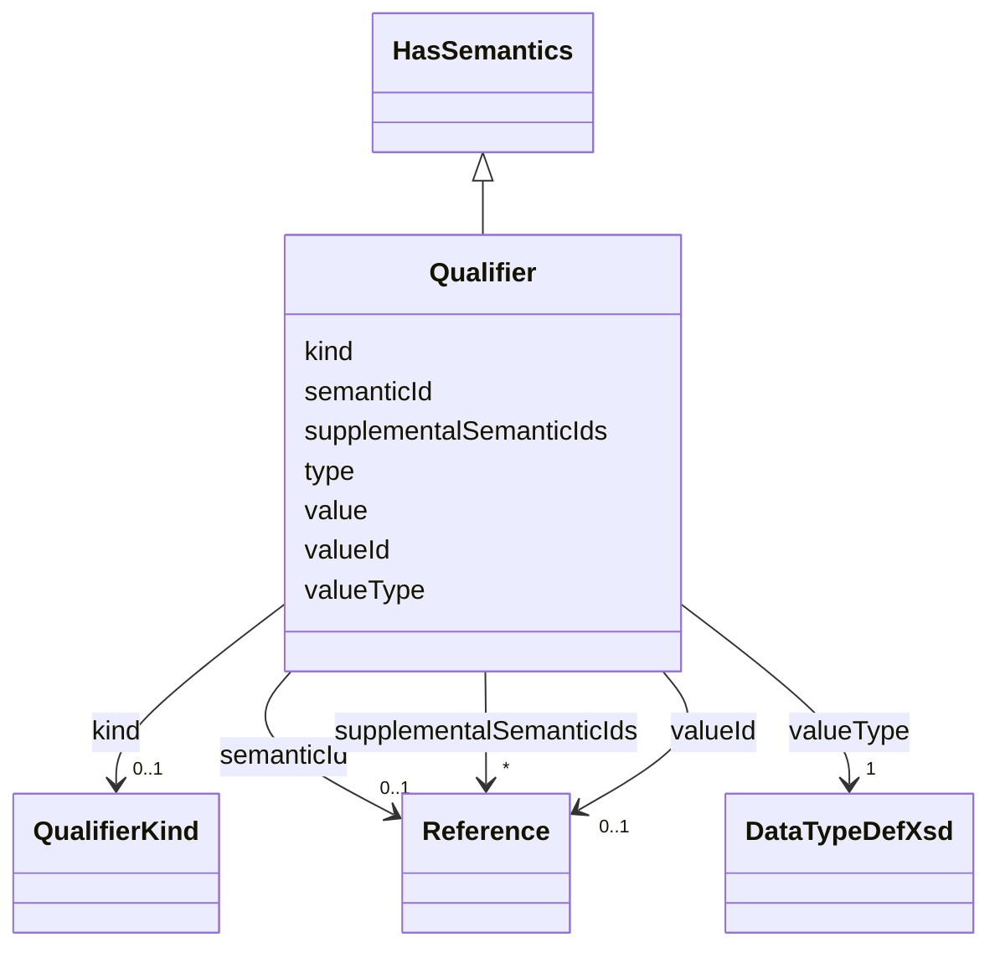

# Class: Qualifier 


_A qualifier is a type-value-pair that makes additional statements w.r.t. the value of the element._


URI: [aas:Qualifier](https://admin-shell.io/aas/3/0/RC02/Qualifier)





## Inheritance
* [HasSemantics](HasSemantics.md)
    * **Qualifier**


## Slots

| Name | Cardinality and Range | Description | Inheritance |
| ---  | --- | --- | --- |
| [kind](kind.md) | 0..1 <br/> [QualifierKind](QualifierKind.md) | The qualifier kind describes the kind of the qualifier that is applied to the... | direct |
| [type](type.md) | 1 <br/> [String](String.md) | The qualifier type describes the type of the qualifier that is applied to the... | direct |
| [value](value.md) | 0..1 <br/> [String](String.md) | The qualifier value is the value of the qualifier | direct |
| [valueId](valueId.md) | 0..1 <br/> [Reference](Reference.md) | Reference to the global unique ID of a coded value | direct |
| [valueType](valueType.md) | 1 <br/> [DataTypeDefXsd](DataTypeDefXsd.md) | Data type of the qualifier value | direct |
| [semanticId](semanticId.md) | 0..1 <br/> [Reference](Reference.md) | Identifier of the semantic definition of the element | [HasSemantics](HasSemantics.md) |
| [supplementalSemanticIds](supplementalSemanticIds.md) | * <br/> [Reference](Reference.md) | Identifier of a supplemental semantic definition of the element | [HasSemantics](HasSemantics.md) |


## Usages

| used by | used in | type | used |
| ---  | --- | --- | --- |
| [AnnotatedRelationshipElement](AnnotatedRelationshipElement.md) | [qualifiers](qualifiers.md) | range | [Qualifier](Qualifier.md) |
| [BasicEventElement](BasicEventElement.md) | [qualifiers](qualifiers.md) | range | [Qualifier](Qualifier.md) |
| [Blob](Blob.md) | [qualifiers](qualifiers.md) | range | [Qualifier](Qualifier.md) |
| [Capability](Capability.md) | [qualifiers](qualifiers.md) | range | [Qualifier](Qualifier.md) |
| [DataElement](DataElement.md) | [qualifiers](qualifiers.md) | range | [Qualifier](Qualifier.md) |
| [Entity](Entity.md) | [qualifiers](qualifiers.md) | range | [Qualifier](Qualifier.md) |
| [EventElement](EventElement.md) | [qualifiers](qualifiers.md) | range | [Qualifier](Qualifier.md) |
| [File](File.md) | [qualifiers](qualifiers.md) | range | [Qualifier](Qualifier.md) |
| [MultiLanguageProperty](MultiLanguageProperty.md) | [qualifiers](qualifiers.md) | range | [Qualifier](Qualifier.md) |
| [Operation](Operation.md) | [qualifiers](qualifiers.md) | range | [Qualifier](Qualifier.md) |
| [Property](Property.md) | [qualifiers](qualifiers.md) | range | [Qualifier](Qualifier.md) |
| [Qualifiable](Qualifiable.md) | [qualifiers](qualifiers.md) | range | [Qualifier](Qualifier.md) |
| [Range](Range.md) | [qualifiers](qualifiers.md) | range | [Qualifier](Qualifier.md) |
| [ReferenceElement](ReferenceElement.md) | [qualifiers](qualifiers.md) | range | [Qualifier](Qualifier.md) |
| [RelationshipElement](RelationshipElement.md) | [qualifiers](qualifiers.md) | range | [Qualifier](Qualifier.md) |
| [Submodel](Submodel.md) | [qualifiers](qualifiers.md) | range | [Qualifier](Qualifier.md) |
| [SubmodelElement](SubmodelElement.md) | [qualifiers](qualifiers.md) | range | [Qualifier](Qualifier.md) |
| [SubmodelElementCollection](SubmodelElementCollection.md) | [qualifiers](qualifiers.md) | range | [Qualifier](Qualifier.md) |
| [SubmodelElementList](SubmodelElementList.md) | [qualifiers](qualifiers.md) | range | [Qualifier](Qualifier.md) |


## Identifier and Mapping Information


### Schema Source


* from schema: https://admin-shell.io/aas/3/0/RC02


## Mappings

| Mapping Type | Mapped Value |
| ---  | ---  |
| self | aas:Qualifier |
| native | aas:Qualifier |


## LinkML Source

<!-- TODO: investigate https://stackoverflow.com/questions/37606292/how-to-create-tabbed-code-blocks-in-mkdocs-or-sphinx -->

### Direct

<details>
```yaml
name: Qualifier
description: A qualifier is a type-value-pair that makes additional statements w.r.t.
  the value of the element.
from_schema: https://admin-shell.io/aas/3/0/RC02
is_a: HasSemantics
attributes:
  kind:
    name: kind
    description: The qualifier kind describes the kind of the qualifier that is applied
      to the element.
    from_schema: https://admin-shell.io/aas/3/0/RC02
    domain_of:
    - HasKind
    - Qualifier
    range: QualifierKind
  type:
    name: type
    description: The qualifier type describes the type of the qualifier that is applied
      to the element.
    from_schema: https://admin-shell.io/aas/3/0/RC02
    domain_of:
    - Key
    - Qualifier
    - Reference
    range: string
    required: true
  value:
    name: value
    description: The qualifier value is the value of the qualifier.
    from_schema: https://admin-shell.io/aas/3/0/RC02
    domain_of:
    - Blob
    - DataSpecificationIec61360
    - Extension
    - File
    - Key
    - MultiLanguageProperty
    - OperationVariable
    - Property
    - Qualifier
    - ReferenceElement
    - SpecificAssetId
    - SubmodelElementCollection
    - SubmodelElementList
    - ValueReferencePair
    range: string
  valueId:
    name: valueId
    description: Reference to the global unique ID of a coded value.
    from_schema: https://admin-shell.io/aas/3/0/RC02
    domain_of:
    - MultiLanguageProperty
    - Property
    - Qualifier
    - ValueReferencePair
    range: Reference
  valueType:
    name: valueType
    description: Data type of the qualifier value.
    from_schema: https://admin-shell.io/aas/3/0/RC02
    domain_of:
    - Extension
    - Property
    - Qualifier
    - Range
    range: DataTypeDefXsd
    required: true

```
</details>

### Induced

<details>
```yaml
name: Qualifier
description: A qualifier is a type-value-pair that makes additional statements w.r.t.
  the value of the element.
from_schema: https://admin-shell.io/aas/3/0/RC02
is_a: HasSemantics
attributes:
  kind:
    name: kind
    description: The qualifier kind describes the kind of the qualifier that is applied
      to the element.
    from_schema: https://admin-shell.io/aas/3/0/RC02
    alias: kind
    owner: Qualifier
    domain_of:
    - HasKind
    - Qualifier
    range: QualifierKind
  type:
    name: type
    description: The qualifier type describes the type of the qualifier that is applied
      to the element.
    from_schema: https://admin-shell.io/aas/3/0/RC02
    alias: type
    owner: Qualifier
    domain_of:
    - Key
    - Qualifier
    - Reference
    range: string
    required: true
  value:
    name: value
    description: The qualifier value is the value of the qualifier.
    from_schema: https://admin-shell.io/aas/3/0/RC02
    alias: value
    owner: Qualifier
    domain_of:
    - Blob
    - DataSpecificationIec61360
    - Extension
    - File
    - Key
    - MultiLanguageProperty
    - OperationVariable
    - Property
    - Qualifier
    - ReferenceElement
    - SpecificAssetId
    - SubmodelElementCollection
    - SubmodelElementList
    - ValueReferencePair
    range: string
  valueId:
    name: valueId
    description: Reference to the global unique ID of a coded value.
    from_schema: https://admin-shell.io/aas/3/0/RC02
    alias: valueId
    owner: Qualifier
    domain_of:
    - MultiLanguageProperty
    - Property
    - Qualifier
    - ValueReferencePair
    range: Reference
  valueType:
    name: valueType
    description: Data type of the qualifier value.
    from_schema: https://admin-shell.io/aas/3/0/RC02
    alias: valueType
    owner: Qualifier
    domain_of:
    - Extension
    - Property
    - Qualifier
    - Range
    range: DataTypeDefXsd
    required: true
  semanticId:
    name: semanticId
    description: Identifier of the semantic definition of the element. It is called
      semantic ID of the element or also main semantic ID of the element.
    from_schema: https://admin-shell.io/aas/3/0/RC02
    rank: 1000
    alias: semanticId
    owner: Qualifier
    domain_of:
    - HasSemantics
    range: Reference
  supplementalSemanticIds:
    name: supplementalSemanticIds
    description: Identifier of a supplemental semantic definition of the element.
      It is called supplemental semantic ID of the element.
    from_schema: https://admin-shell.io/aas/3/0/RC02
    rank: 1000
    alias: supplementalSemanticIds
    owner: Qualifier
    domain_of:
    - HasSemantics
    range: Reference
    multivalued: true

```
</details>