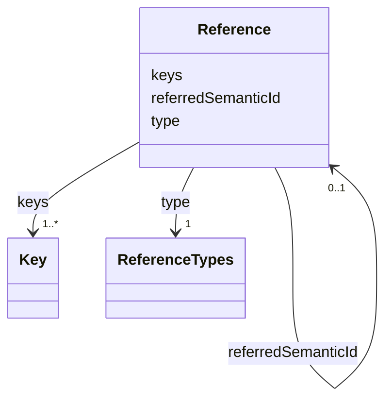

# Class: Reference 


_Reference to either a model element of the same or another AAS or to an external entity._


URI: [aas:Reference](https://admin-shell.io/aas/3/0/RC02/Reference)





<!-- no inheritance hierarchy -->


## Slots

| Name | Cardinality and Range | Description | Inheritance |
| ---  | --- | --- | --- |
| [keys](keys.md) | 1..* <br/> [Key](Key.md) | Unique references in their name space | direct |
| [referredSemanticId](referredSemanticId.md) | 0..1 <br/> [Reference](Reference.md) | 'semanticId' of the referenced model element ('type' = 'ModelReference') | direct |
| [type](type.md) | 1 <br/> [ReferenceTypes](ReferenceTypes.md) | Type of the reference | direct |


## Usages

| used by | used in | type | used |
| ---  | --- | --- | --- |
| [AnnotatedRelationshipElement](AnnotatedRelationshipElement.md) | [first](first.md) | range | [Reference](Reference.md) |
| [AnnotatedRelationshipElement](AnnotatedRelationshipElement.md) | [second](second.md) | range | [Reference](Reference.md) |
| [AnnotatedRelationshipElement](AnnotatedRelationshipElement.md) | [semanticId](semanticId.md) | range | [Reference](Reference.md) |
| [AnnotatedRelationshipElement](AnnotatedRelationshipElement.md) | [supplementalSemanticIds](supplementalSemanticIds.md) | range | [Reference](Reference.md) |
| [AssetAdministrationShell](AssetAdministrationShell.md) | [derivedFrom](derivedFrom.md) | range | [Reference](Reference.md) |
| [AssetAdministrationShell](AssetAdministrationShell.md) | [submodels](submodels.md) | range | [Reference](Reference.md) |
| [AssetInformation](AssetInformation.md) | [globalAssetId](globalAssetId.md) | range | [Reference](Reference.md) |
| [BasicEventElement](BasicEventElement.md) | [messageBroker](messageBroker.md) | range | [Reference](Reference.md) |
| [BasicEventElement](BasicEventElement.md) | [observed](observed.md) | range | [Reference](Reference.md) |
| [BasicEventElement](BasicEventElement.md) | [semanticId](semanticId.md) | range | [Reference](Reference.md) |
| [BasicEventElement](BasicEventElement.md) | [supplementalSemanticIds](supplementalSemanticIds.md) | range | [Reference](Reference.md) |
| [Blob](Blob.md) | [semanticId](semanticId.md) | range | [Reference](Reference.md) |
| [Blob](Blob.md) | [supplementalSemanticIds](supplementalSemanticIds.md) | range | [Reference](Reference.md) |
| [Capability](Capability.md) | [semanticId](semanticId.md) | range | [Reference](Reference.md) |
| [Capability](Capability.md) | [supplementalSemanticIds](supplementalSemanticIds.md) | range | [Reference](Reference.md) |
| [ConceptDescription](ConceptDescription.md) | [isCaseOf](isCaseOf.md) | range | [Reference](Reference.md) |
| [DataElement](DataElement.md) | [semanticId](semanticId.md) | range | [Reference](Reference.md) |
| [DataElement](DataElement.md) | [supplementalSemanticIds](supplementalSemanticIds.md) | range | [Reference](Reference.md) |
| [DataSpecificationIec61360](DataSpecificationIec61360.md) | [unitId](unitId.md) | range | [Reference](Reference.md) |
| [EmbeddedDataSpecification](EmbeddedDataSpecification.md) | [dataSpecification](dataSpecification.md) | range | [Reference](Reference.md) |
| [Entity](Entity.md) | [globalAssetId](globalAssetId.md) | range | [Reference](Reference.md) |
| [Entity](Entity.md) | [semanticId](semanticId.md) | range | [Reference](Reference.md) |
| [Entity](Entity.md) | [supplementalSemanticIds](supplementalSemanticIds.md) | range | [Reference](Reference.md) |
| [EventElement](EventElement.md) | [semanticId](semanticId.md) | range | [Reference](Reference.md) |
| [EventElement](EventElement.md) | [supplementalSemanticIds](supplementalSemanticIds.md) | range | [Reference](Reference.md) |
| [EventPayload](EventPayload.md) | [observableReference](observableReference.md) | range | [Reference](Reference.md) |
| [EventPayload](EventPayload.md) | [observableSemanticId](observableSemanticId.md) | range | [Reference](Reference.md) |
| [EventPayload](EventPayload.md) | [source](source.md) | range | [Reference](Reference.md) |
| [EventPayload](EventPayload.md) | [sourceSemanticId](sourceSemanticId.md) | range | [Reference](Reference.md) |
| [EventPayload](EventPayload.md) | [subjectId](subjectId.md) | range | [Reference](Reference.md) |
| [Extension](Extension.md) | [refersTo](refersTo.md) | range | [Reference](Reference.md) |
| [Extension](Extension.md) | [semanticId](semanticId.md) | range | [Reference](Reference.md) |
| [Extension](Extension.md) | [supplementalSemanticIds](supplementalSemanticIds.md) | range | [Reference](Reference.md) |
| [File](File.md) | [semanticId](semanticId.md) | range | [Reference](Reference.md) |
| [File](File.md) | [supplementalSemanticIds](supplementalSemanticIds.md) | range | [Reference](Reference.md) |
| [HasSemantics](HasSemantics.md) | [semanticId](semanticId.md) | range | [Reference](Reference.md) |
| [HasSemantics](HasSemantics.md) | [supplementalSemanticIds](supplementalSemanticIds.md) | range | [Reference](Reference.md) |
| [MultiLanguageProperty](MultiLanguageProperty.md) | [valueId](valueId.md) | range | [Reference](Reference.md) |
| [MultiLanguageProperty](MultiLanguageProperty.md) | [semanticId](semanticId.md) | range | [Reference](Reference.md) |
| [MultiLanguageProperty](MultiLanguageProperty.md) | [supplementalSemanticIds](supplementalSemanticIds.md) | range | [Reference](Reference.md) |
| [Operation](Operation.md) | [semanticId](semanticId.md) | range | [Reference](Reference.md) |
| [Operation](Operation.md) | [supplementalSemanticIds](supplementalSemanticIds.md) | range | [Reference](Reference.md) |
| [Property](Property.md) | [valueId](valueId.md) | range | [Reference](Reference.md) |
| [Property](Property.md) | [semanticId](semanticId.md) | range | [Reference](Reference.md) |
| [Property](Property.md) | [supplementalSemanticIds](supplementalSemanticIds.md) | range | [Reference](Reference.md) |
| [Qualifier](Qualifier.md) | [valueId](valueId.md) | range | [Reference](Reference.md) |
| [Qualifier](Qualifier.md) | [semanticId](semanticId.md) | range | [Reference](Reference.md) |
| [Qualifier](Qualifier.md) | [supplementalSemanticIds](supplementalSemanticIds.md) | range | [Reference](Reference.md) |
| [Range](Range.md) | [semanticId](semanticId.md) | range | [Reference](Reference.md) |
| [Range](Range.md) | [supplementalSemanticIds](supplementalSemanticIds.md) | range | [Reference](Reference.md) |
| [Reference](Reference.md) | [referredSemanticId](referredSemanticId.md) | range | [Reference](Reference.md) |
| [ReferenceElement](ReferenceElement.md) | [value](value.md) | range | [Reference](Reference.md) |
| [ReferenceElement](ReferenceElement.md) | [semanticId](semanticId.md) | range | [Reference](Reference.md) |
| [ReferenceElement](ReferenceElement.md) | [supplementalSemanticIds](supplementalSemanticIds.md) | range | [Reference](Reference.md) |
| [RelationshipElement](RelationshipElement.md) | [first](first.md) | range | [Reference](Reference.md) |
| [RelationshipElement](RelationshipElement.md) | [second](second.md) | range | [Reference](Reference.md) |
| [RelationshipElement](RelationshipElement.md) | [semanticId](semanticId.md) | range | [Reference](Reference.md) |
| [RelationshipElement](RelationshipElement.md) | [supplementalSemanticIds](supplementalSemanticIds.md) | range | [Reference](Reference.md) |
| [SpecificAssetId](SpecificAssetId.md) | [externalSubjectId](externalSubjectId.md) | range | [Reference](Reference.md) |
| [SpecificAssetId](SpecificAssetId.md) | [semanticId](semanticId.md) | range | [Reference](Reference.md) |
| [SpecificAssetId](SpecificAssetId.md) | [supplementalSemanticIds](supplementalSemanticIds.md) | range | [Reference](Reference.md) |
| [Submodel](Submodel.md) | [semanticId](semanticId.md) | range | [Reference](Reference.md) |
| [Submodel](Submodel.md) | [supplementalSemanticIds](supplementalSemanticIds.md) | range | [Reference](Reference.md) |
| [SubmodelElement](SubmodelElement.md) | [semanticId](semanticId.md) | range | [Reference](Reference.md) |
| [SubmodelElement](SubmodelElement.md) | [supplementalSemanticIds](supplementalSemanticIds.md) | range | [Reference](Reference.md) |
| [SubmodelElementCollection](SubmodelElementCollection.md) | [semanticId](semanticId.md) | range | [Reference](Reference.md) |
| [SubmodelElementCollection](SubmodelElementCollection.md) | [supplementalSemanticIds](supplementalSemanticIds.md) | range | [Reference](Reference.md) |
| [SubmodelElementList](SubmodelElementList.md) | [semanticIdListElement](semanticIdListElement.md) | range | [Reference](Reference.md) |
| [SubmodelElementList](SubmodelElementList.md) | [semanticId](semanticId.md) | range | [Reference](Reference.md) |
| [SubmodelElementList](SubmodelElementList.md) | [supplementalSemanticIds](supplementalSemanticIds.md) | range | [Reference](Reference.md) |
| [ValueReferencePair](ValueReferencePair.md) | [valueId](valueId.md) | range | [Reference](Reference.md) |


## Identifier and Mapping Information


### Schema Source


* from schema: https://admin-shell.io/aas/3/0/RC02


## Mappings

| Mapping Type | Mapped Value |
| ---  | ---  |
| self | aas:Reference |
| native | aas:Reference |


## LinkML Source

<!-- TODO: investigate https://stackoverflow.com/questions/37606292/how-to-create-tabbed-code-blocks-in-mkdocs-or-sphinx -->

### Direct

<details>
```yaml
name: Reference
description: Reference to either a model element of the same or another AAS or to
  an external entity.
from_schema: https://admin-shell.io/aas/3/0/RC02
attributes:
  keys:
    name: keys
    description: Unique references in their name space.
    from_schema: https://admin-shell.io/aas/3/0/RC02
    rank: 1000
    domain_of:
    - Reference
    range: Key
    required: true
    multivalued: true
  referredSemanticId:
    name: referredSemanticId
    description: '''semanticId'' of the referenced model element (''type'' = ''ModelReference'').'
    from_schema: https://admin-shell.io/aas/3/0/RC02
    rank: 1000
    domain_of:
    - Reference
    range: Reference
  type:
    name: type
    description: Type of the reference.
    from_schema: https://admin-shell.io/aas/3/0/RC02
    domain_of:
    - Key
    - Qualifier
    - Reference
    range: ReferenceTypes
    required: true

```
</details>

### Induced

<details>
```yaml
name: Reference
description: Reference to either a model element of the same or another AAS or to
  an external entity.
from_schema: https://admin-shell.io/aas/3/0/RC02
attributes:
  keys:
    name: keys
    description: Unique references in their name space.
    from_schema: https://admin-shell.io/aas/3/0/RC02
    rank: 1000
    alias: keys
    owner: Reference
    domain_of:
    - Reference
    range: Key
    required: true
    multivalued: true
  referredSemanticId:
    name: referredSemanticId
    description: '''semanticId'' of the referenced model element (''type'' = ''ModelReference'').'
    from_schema: https://admin-shell.io/aas/3/0/RC02
    rank: 1000
    alias: referredSemanticId
    owner: Reference
    domain_of:
    - Reference
    range: Reference
  type:
    name: type
    description: Type of the reference.
    from_schema: https://admin-shell.io/aas/3/0/RC02
    alias: type
    owner: Reference
    domain_of:
    - Key
    - Qualifier
    - Reference
    range: ReferenceTypes
    required: true

```
</details>