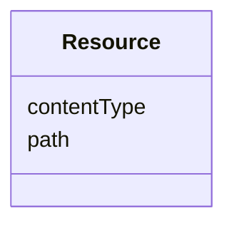

# Class: Resource 


_Resource represents an address to a file (a locator). The value is an URI that can represent an absolute or relative path_


URI: [aas:Resource](https://admin-shell.io/aas/3/0/RC02/Resource)





<!-- no inheritance hierarchy -->


## Slots

| Name | Cardinality and Range | Description | Inheritance |
| ---  | --- | --- | --- |
| [contentType](contentType.md) | 0..1 <br/> [String](String.md) | Content type of the content of the file | direct |
| [path](path.md) | 1 <br/> [String](String.md) | Path and name of the resource (with file extension) | direct |


## Usages

| used by | used in | type | used |
| ---  | --- | --- | --- |
| [AssetInformation](AssetInformation.md) | [defaultThumbnail](defaultThumbnail.md) | range | [Resource](Resource.md) |


## Identifier and Mapping Information


### Schema Source


* from schema: https://admin-shell.io/aas/3/0/RC02


## Mappings

| Mapping Type | Mapped Value |
| ---  | ---  |
| self | aas:Resource |
| native | aas:Resource |


## LinkML Source

<!-- TODO: investigate https://stackoverflow.com/questions/37606292/how-to-create-tabbed-code-blocks-in-mkdocs-or-sphinx -->

### Direct

<details>
```yaml
name: Resource
description: Resource represents an address to a file (a locator). The value is an
  URI that can represent an absolute or relative path
from_schema: https://admin-shell.io/aas/3/0/RC02
attributes:
  contentType:
    name: contentType
    description: Content type of the content of the file.
    from_schema: https://admin-shell.io/aas/3/0/RC02
    domain_of:
    - Blob
    - File
    - Resource
    range: string
    pattern: ^([!#$%&'*+\-.^_`|~0-9a-zA-Z])+/([!#$%&'*+\-.^_`|~0-9a-zA-Z])+([ \t]*;[
      \t]*([!#$%&'*+\-.^_`|~0-9a-zA-Z])+=(([!#$%&'*+\-.^_`|~0-9a-zA-Z])+|"(([\t !#-\[\]-~]|[\x80-\xff])|\\([\t
      !-~]|[\x80-\xff]))*"))*$
  path:
    name: path
    description: Path and name of the resource (with file extension).
    from_schema: https://admin-shell.io/aas/3/0/RC02
    rank: 1000
    domain_of:
    - Resource
    range: string
    required: true
    pattern: ^file:(//((localhost|(\[((([0-9A-Fa-f]{1,4}:){6}([0-9A-Fa-f]{1,4}:[0-9A-Fa-f]{1,4}|([0-9]|[1-9][0-9]|1[0-9]{2}|2[0-4][0-9]|25[0-5])\.([0-9]|[1-9][0-9]|1[0-9]{2}|2[0-4][0-9]|25[0-5])\.([0-9]|[1-9][0-9]|1[0-9]{2}|2[0-4][0-9]|25[0-5])\.([0-9]|[1-9][0-9]|1[0-9]{2}|2[0-4][0-9]|25[0-5]))|::([0-9A-Fa-f]{1,4}:){5}([0-9A-Fa-f]{1,4}:[0-9A-Fa-f]{1,4}|([0-9]|[1-9][0-9]|1[0-9]{2}|2[0-4][0-9]|25[0-5])\.([0-9]|[1-9][0-9]|1[0-9]{2}|2[0-4][0-9]|25[0-5])\.([0-9]|[1-9][0-9]|1[0-9]{2}|2[0-4][0-9]|25[0-5])\.([0-9]|[1-9][0-9]|1[0-9]{2}|2[0-4][0-9]|25[0-5]))|([0-9A-Fa-f]{1,4})?::([0-9A-Fa-f]{1,4}:){4}([0-9A-Fa-f]{1,4}:[0-9A-Fa-f]{1,4}|([0-9]|[1-9][0-9]|1[0-9]{2}|2[0-4][0-9]|25[0-5])\.([0-9]|[1-9][0-9]|1[0-9]{2}|2[0-4][0-9]|25[0-5])\.([0-9]|[1-9][0-9]|1[0-9]{2}|2[0-4][0-9]|25[0-5])\.([0-9]|[1-9][0-9]|1[0-9]{2}|2[0-4][0-9]|25[0-5]))|(([0-9A-Fa-f]{1,4}:)?[0-9A-Fa-f]{1,4})?::([0-9A-Fa-f]{1,4}:){3}([0-9A-Fa-f]{1,4}:[0-9A-Fa-f]{1,4}|([0-9]|[1-9][0-9]|1[0-9]{2}|2[0-4][0-9]|25[0-5])\.([0-9]|[1-9][0-9]|1[0-9]{2}|2[0-4][0-9]|25[0-5])\.([0-9]|[1-9][0-9]|1[0-9]{2}|2[0-4][0-9]|25[0-5])\.([0-9]|[1-9][0-9]|1[0-9]{2}|2[0-4][0-9]|25[0-5]))|(([0-9A-Fa-f]{1,4}:){2}[0-9A-Fa-f]{1,4})?::([0-9A-Fa-f]{1,4}:){2}([0-9A-Fa-f]{1,4}:[0-9A-Fa-f]{1,4}|([0-9]|[1-9][0-9]|1[0-9]{2}|2[0-4][0-9]|25[0-5])\.([0-9]|[1-9][0-9]|1[0-9]{2}|2[0-4][0-9]|25[0-5])\.([0-9]|[1-9][0-9]|1[0-9]{2}|2[0-4][0-9]|25[0-5])\.([0-9]|[1-9][0-9]|1[0-9]{2}|2[0-4][0-9]|25[0-5]))|(([0-9A-Fa-f]{1,4}:){3}[0-9A-Fa-f]{1,4})?::[0-9A-Fa-f]{1,4}:([0-9A-Fa-f]{1,4}:[0-9A-Fa-f]{1,4}|([0-9]|[1-9][0-9]|1[0-9]{2}|2[0-4][0-9]|25[0-5])\.([0-9]|[1-9][0-9]|1[0-9]{2}|2[0-4][0-9]|25[0-5])\.([0-9]|[1-9][0-9]|1[0-9]{2}|2[0-4][0-9]|25[0-5])\.([0-9]|[1-9][0-9]|1[0-9]{2}|2[0-4][0-9]|25[0-5]))|(([0-9A-Fa-f]{1,4}:){4}[0-9A-Fa-f]{1,4})?::([0-9A-Fa-f]{1,4}:[0-9A-Fa-f]{1,4}|([0-9]|[1-9][0-9]|1[0-9]{2}|2[0-4][0-9]|25[0-5])\.([0-9]|[1-9][0-9]|1[0-9]{2}|2[0-4][0-9]|25[0-5])\.([0-9]|[1-9][0-9]|1[0-9]{2}|2[0-4][0-9]|25[0-5])\.([0-9]|[1-9][0-9]|1[0-9]{2}|2[0-4][0-9]|25[0-5]))|(([0-9A-Fa-f]{1,4}:){5}[0-9A-Fa-f]{1,4})?::[0-9A-Fa-f]{1,4}|(([0-9A-Fa-f]{1,4}:){6}[0-9A-Fa-f]{1,4})?::)|[vV][0-9A-Fa-f]+\.([a-zA-Z0-9\-._~]|[!$&'()*+,;=]|:)+)\]|([0-9]|[1-9][0-9]|1[0-9]{2}|2[0-4][0-9]|25[0-5])\.([0-9]|[1-9][0-9]|1[0-9]{2}|2[0-4][0-9]|25[0-5])\.([0-9]|[1-9][0-9]|1[0-9]{2}|2[0-4][0-9]|25[0-5])\.([0-9]|[1-9][0-9]|1[0-9]{2}|2[0-4][0-9]|25[0-5])|([a-zA-Z0-9\-._~]|%[0-9A-Fa-f][0-9A-Fa-f]|[!$&'()*+,;=])*)))?/((([a-zA-Z0-9\-._~]|%[0-9A-Fa-f][0-9A-Fa-f]|[!$&'()*+,;=]|[:@]))+(/(([a-zA-Z0-9\-._~]|%[0-9A-Fa-f][0-9A-Fa-f]|[!$&'()*+,;=]|[:@]))*)*)?|/((([a-zA-Z0-9\-._~]|%[0-9A-Fa-f][0-9A-Fa-f]|[!$&'()*+,;=]|[:@]))+(/(([a-zA-Z0-9\-._~]|%[0-9A-Fa-f][0-9A-Fa-f]|[!$&'()*+,;=]|[:@]))*)*)?)$

```
</details>

### Induced

<details>
```yaml
name: Resource
description: Resource represents an address to a file (a locator). The value is an
  URI that can represent an absolute or relative path
from_schema: https://admin-shell.io/aas/3/0/RC02
attributes:
  contentType:
    name: contentType
    description: Content type of the content of the file.
    from_schema: https://admin-shell.io/aas/3/0/RC02
    alias: contentType
    owner: Resource
    domain_of:
    - Blob
    - File
    - Resource
    range: string
    pattern: ^([!#$%&'*+\-.^_`|~0-9a-zA-Z])+/([!#$%&'*+\-.^_`|~0-9a-zA-Z])+([ \t]*;[
      \t]*([!#$%&'*+\-.^_`|~0-9a-zA-Z])+=(([!#$%&'*+\-.^_`|~0-9a-zA-Z])+|"(([\t !#-\[\]-~]|[\x80-\xff])|\\([\t
      !-~]|[\x80-\xff]))*"))*$
  path:
    name: path
    description: Path and name of the resource (with file extension).
    from_schema: https://admin-shell.io/aas/3/0/RC02
    rank: 1000
    alias: path
    owner: Resource
    domain_of:
    - Resource
    range: string
    required: true
    pattern: ^file:(//((localhost|(\[((([0-9A-Fa-f]{1,4}:){6}([0-9A-Fa-f]{1,4}:[0-9A-Fa-f]{1,4}|([0-9]|[1-9][0-9]|1[0-9]{2}|2[0-4][0-9]|25[0-5])\.([0-9]|[1-9][0-9]|1[0-9]{2}|2[0-4][0-9]|25[0-5])\.([0-9]|[1-9][0-9]|1[0-9]{2}|2[0-4][0-9]|25[0-5])\.([0-9]|[1-9][0-9]|1[0-9]{2}|2[0-4][0-9]|25[0-5]))|::([0-9A-Fa-f]{1,4}:){5}([0-9A-Fa-f]{1,4}:[0-9A-Fa-f]{1,4}|([0-9]|[1-9][0-9]|1[0-9]{2}|2[0-4][0-9]|25[0-5])\.([0-9]|[1-9][0-9]|1[0-9]{2}|2[0-4][0-9]|25[0-5])\.([0-9]|[1-9][0-9]|1[0-9]{2}|2[0-4][0-9]|25[0-5])\.([0-9]|[1-9][0-9]|1[0-9]{2}|2[0-4][0-9]|25[0-5]))|([0-9A-Fa-f]{1,4})?::([0-9A-Fa-f]{1,4}:){4}([0-9A-Fa-f]{1,4}:[0-9A-Fa-f]{1,4}|([0-9]|[1-9][0-9]|1[0-9]{2}|2[0-4][0-9]|25[0-5])\.([0-9]|[1-9][0-9]|1[0-9]{2}|2[0-4][0-9]|25[0-5])\.([0-9]|[1-9][0-9]|1[0-9]{2}|2[0-4][0-9]|25[0-5])\.([0-9]|[1-9][0-9]|1[0-9]{2}|2[0-4][0-9]|25[0-5]))|(([0-9A-Fa-f]{1,4}:)?[0-9A-Fa-f]{1,4})?::([0-9A-Fa-f]{1,4}:){3}([0-9A-Fa-f]{1,4}:[0-9A-Fa-f]{1,4}|([0-9]|[1-9][0-9]|1[0-9]{2}|2[0-4][0-9]|25[0-5])\.([0-9]|[1-9][0-9]|1[0-9]{2}|2[0-4][0-9]|25[0-5])\.([0-9]|[1-9][0-9]|1[0-9]{2}|2[0-4][0-9]|25[0-5])\.([0-9]|[1-9][0-9]|1[0-9]{2}|2[0-4][0-9]|25[0-5]))|(([0-9A-Fa-f]{1,4}:){2}[0-9A-Fa-f]{1,4})?::([0-9A-Fa-f]{1,4}:){2}([0-9A-Fa-f]{1,4}:[0-9A-Fa-f]{1,4}|([0-9]|[1-9][0-9]|1[0-9]{2}|2[0-4][0-9]|25[0-5])\.([0-9]|[1-9][0-9]|1[0-9]{2}|2[0-4][0-9]|25[0-5])\.([0-9]|[1-9][0-9]|1[0-9]{2}|2[0-4][0-9]|25[0-5])\.([0-9]|[1-9][0-9]|1[0-9]{2}|2[0-4][0-9]|25[0-5]))|(([0-9A-Fa-f]{1,4}:){3}[0-9A-Fa-f]{1,4})?::[0-9A-Fa-f]{1,4}:([0-9A-Fa-f]{1,4}:[0-9A-Fa-f]{1,4}|([0-9]|[1-9][0-9]|1[0-9]{2}|2[0-4][0-9]|25[0-5])\.([0-9]|[1-9][0-9]|1[0-9]{2}|2[0-4][0-9]|25[0-5])\.([0-9]|[1-9][0-9]|1[0-9]{2}|2[0-4][0-9]|25[0-5])\.([0-9]|[1-9][0-9]|1[0-9]{2}|2[0-4][0-9]|25[0-5]))|(([0-9A-Fa-f]{1,4}:){4}[0-9A-Fa-f]{1,4})?::([0-9A-Fa-f]{1,4}:[0-9A-Fa-f]{1,4}|([0-9]|[1-9][0-9]|1[0-9]{2}|2[0-4][0-9]|25[0-5])\.([0-9]|[1-9][0-9]|1[0-9]{2}|2[0-4][0-9]|25[0-5])\.([0-9]|[1-9][0-9]|1[0-9]{2}|2[0-4][0-9]|25[0-5])\.([0-9]|[1-9][0-9]|1[0-9]{2}|2[0-4][0-9]|25[0-5]))|(([0-9A-Fa-f]{1,4}:){5}[0-9A-Fa-f]{1,4})?::[0-9A-Fa-f]{1,4}|(([0-9A-Fa-f]{1,4}:){6}[0-9A-Fa-f]{1,4})?::)|[vV][0-9A-Fa-f]+\.([a-zA-Z0-9\-._~]|[!$&'()*+,;=]|:)+)\]|([0-9]|[1-9][0-9]|1[0-9]{2}|2[0-4][0-9]|25[0-5])\.([0-9]|[1-9][0-9]|1[0-9]{2}|2[0-4][0-9]|25[0-5])\.([0-9]|[1-9][0-9]|1[0-9]{2}|2[0-4][0-9]|25[0-5])\.([0-9]|[1-9][0-9]|1[0-9]{2}|2[0-4][0-9]|25[0-5])|([a-zA-Z0-9\-._~]|%[0-9A-Fa-f][0-9A-Fa-f]|[!$&'()*+,;=])*)))?/((([a-zA-Z0-9\-._~]|%[0-9A-Fa-f][0-9A-Fa-f]|[!$&'()*+,;=]|[:@]))+(/(([a-zA-Z0-9\-._~]|%[0-9A-Fa-f][0-9A-Fa-f]|[!$&'()*+,;=]|[:@]))*)*)?|/((([a-zA-Z0-9\-._~]|%[0-9A-Fa-f][0-9A-Fa-f]|[!$&'()*+,;=]|[:@]))+(/(([a-zA-Z0-9\-._~]|%[0-9A-Fa-f][0-9A-Fa-f]|[!$&'()*+,;=]|[:@]))*)*)?)$

```
</details>