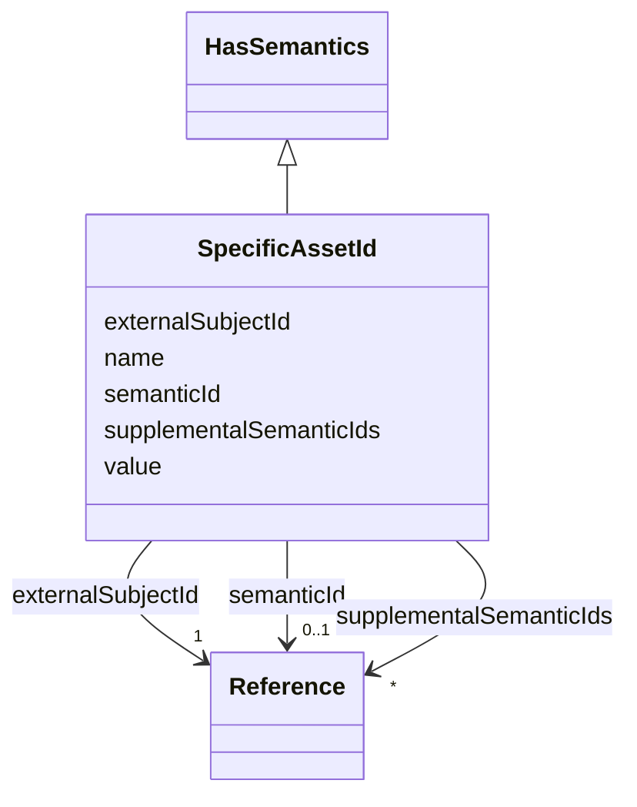

# Class: SpecificAssetId 


_A specific asset ID describes a generic supplementary identifying attribute of the asset._


URI: [aas:SpecificAssetId](https://admin-shell.io/aas/3/0/RC02/SpecificAssetId)





## Inheritance
* [HasSemantics](HasSemantics.md)
    * **SpecificAssetId**


## Slots

| Name | Cardinality and Range | Description | Inheritance |
| ---  | --- | --- | --- |
| [externalSubjectId](externalSubjectId.md) | 1 <br/> [Reference](Reference.md) | The (external) subject the key belongs to or has meaning to | direct |
| [name](name.md) | 1 <br/> [String](String.md) | Name of the identifier | direct |
| [value](value.md) | 1 <br/> [String](String.md) | The value of the specific asset identifier with the corresponding name | direct |
| [semanticId](semanticId.md) | 0..1 <br/> [Reference](Reference.md) | Identifier of the semantic definition of the element | [HasSemantics](HasSemantics.md) |
| [supplementalSemanticIds](supplementalSemanticIds.md) | * <br/> [Reference](Reference.md) | Identifier of a supplemental semantic definition of the element | [HasSemantics](HasSemantics.md) |


## Usages

| used by | used in | type | used |
| ---  | --- | --- | --- |
| [AssetInformation](AssetInformation.md) | [specificAssetIds](specificAssetIds.md) | range | [SpecificAssetId](SpecificAssetId.md) |
| [Entity](Entity.md) | [specificAssetId](specificAssetId.md) | range | [SpecificAssetId](SpecificAssetId.md) |


## Identifier and Mapping Information


### Schema Source


* from schema: https://admin-shell.io/aas/3/0/RC02


## Mappings

| Mapping Type | Mapped Value |
| ---  | ---  |
| self | aas:SpecificAssetId |
| native | aas:SpecificAssetId |


## LinkML Source

<!-- TODO: investigate https://stackoverflow.com/questions/37606292/how-to-create-tabbed-code-blocks-in-mkdocs-or-sphinx -->

### Direct

<details>
```yaml
name: SpecificAssetId
description: A specific asset ID describes a generic supplementary identifying attribute
  of the asset.
from_schema: https://admin-shell.io/aas/3/0/RC02
is_a: HasSemantics
attributes:
  externalSubjectId:
    name: externalSubjectId
    description: The (external) subject the key belongs to or has meaning to.
    from_schema: https://admin-shell.io/aas/3/0/RC02
    rank: 1000
    domain_of:
    - SpecificAssetId
    range: Reference
    required: true
  name:
    name: name
    description: Name of the identifier
    from_schema: https://admin-shell.io/aas/3/0/RC02
    domain_of:
    - Extension
    - SpecificAssetId
    range: string
    required: true
  value:
    name: value
    description: The value of the specific asset identifier with the corresponding
      name.
    from_schema: https://admin-shell.io/aas/3/0/RC02
    domain_of:
    - Blob
    - DataSpecificationIec61360
    - Extension
    - File
    - Key
    - MultiLanguageProperty
    - OperationVariable
    - Property
    - Qualifier
    - ReferenceElement
    - SpecificAssetId
    - SubmodelElementCollection
    - SubmodelElementList
    - ValueReferencePair
    range: string
    required: true

```
</details>

### Induced

<details>
```yaml
name: SpecificAssetId
description: A specific asset ID describes a generic supplementary identifying attribute
  of the asset.
from_schema: https://admin-shell.io/aas/3/0/RC02
is_a: HasSemantics
attributes:
  externalSubjectId:
    name: externalSubjectId
    description: The (external) subject the key belongs to or has meaning to.
    from_schema: https://admin-shell.io/aas/3/0/RC02
    rank: 1000
    alias: externalSubjectId
    owner: SpecificAssetId
    domain_of:
    - SpecificAssetId
    range: Reference
    required: true
  name:
    name: name
    description: Name of the identifier
    from_schema: https://admin-shell.io/aas/3/0/RC02
    alias: name
    owner: SpecificAssetId
    domain_of:
    - Extension
    - SpecificAssetId
    range: string
    required: true
  value:
    name: value
    description: The value of the specific asset identifier with the corresponding
      name.
    from_schema: https://admin-shell.io/aas/3/0/RC02
    alias: value
    owner: SpecificAssetId
    domain_of:
    - Blob
    - DataSpecificationIec61360
    - Extension
    - File
    - Key
    - MultiLanguageProperty
    - OperationVariable
    - Property
    - Qualifier
    - ReferenceElement
    - SpecificAssetId
    - SubmodelElementCollection
    - SubmodelElementList
    - ValueReferencePair
    range: string
    required: true
  semanticId:
    name: semanticId
    description: Identifier of the semantic definition of the element. It is called
      semantic ID of the element or also main semantic ID of the element.
    from_schema: https://admin-shell.io/aas/3/0/RC02
    rank: 1000
    alias: semanticId
    owner: SpecificAssetId
    domain_of:
    - HasSemantics
    range: Reference
  supplementalSemanticIds:
    name: supplementalSemanticIds
    description: Identifier of a supplemental semantic definition of the element.
      It is called supplemental semantic ID of the element.
    from_schema: https://admin-shell.io/aas/3/0/RC02
    rank: 1000
    alias: supplementalSemanticIds
    owner: SpecificAssetId
    domain_of:
    - HasSemantics
    range: Reference
    multivalued: true

```
</details>