# Class: SubmodelElement 


_A submodel element is an element suitable for the description and differentiation of assets._


* __NOTE__: this is an abstract class and should not be instantiated directly


URI: [aas:SubmodelElement](https://admin-shell.io/aas/3/0/RC02/SubmodelElement)

```mermaid
 classDiagram
    class SubmodelElement
    click SubmodelElement href "../SubmodelElement/"
      Referable <|-- SubmodelElement
        click Referable href "../Referable/"
      HasKind <|-- SubmodelElement
        click HasKind href "../HasKind/"
      HasSemantics <|-- SubmodelElement
        click HasSemantics href "../HasSemantics/"
      Qualifiable <|-- SubmodelElement
        click Qualifiable href "../Qualifiable/"
      HasDataSpecification <|-- SubmodelElement
        click HasDataSpecification href "../HasDataSpecification/"
      

      SubmodelElement <|-- Capability
        click Capability href "../Capability/"
      SubmodelElement <|-- DataElement
        click DataElement href "../DataElement/"
      SubmodelElement <|-- Entity
        click Entity href "../Entity/"
      SubmodelElement <|-- EventElement
        click EventElement href "../EventElement/"
      SubmodelElement <|-- Operation
        click Operation href "../Operation/"
      SubmodelElement <|-- RelationshipElement
        click RelationshipElement href "../RelationshipElement/"
      SubmodelElement <|-- SubmodelElementCollection
        click SubmodelElementCollection href "../SubmodelElementCollection/"
      SubmodelElement <|-- SubmodelElementList
        click SubmodelElementList href "../SubmodelElementList/"
      

      SubmodelElement : category
        
      SubmodelElement : checksum
        
      SubmodelElement : description
        
      SubmodelElement : displayName
        
      SubmodelElement : embeddedDataSpecifications
        
          
    
        
        
        SubmodelElement --> "*" EmbeddedDataSpecification : embeddedDataSpecifications
        click EmbeddedDataSpecification href "../EmbeddedDataSpecification/"
    

        
      SubmodelElement : extensions
        
          
    
        
        
        SubmodelElement --> "*" Extension : extensions
        click Extension href "../Extension/"
    

        
      SubmodelElement : idShort
        
      SubmodelElement : kind
        
          
    
        
        
        SubmodelElement --> "0..1" ModelingKind : kind
        click ModelingKind href "../ModelingKind/"
    

        
      SubmodelElement : qualifiers
        
          
    
        
        
        SubmodelElement --> "*" Qualifier : qualifiers
        click Qualifier href "../Qualifier/"
    

        
      SubmodelElement : semanticId
        
          
    
        
        
        SubmodelElement --> "0..1" Reference : semanticId
        click Reference href "../Reference/"
    

        
      SubmodelElement : supplementalSemanticIds
        
          
    
        
        
        SubmodelElement --> "*" Reference : supplementalSemanticIds
        click Reference href "../Reference/"
    

        
      
```





## Inheritance
* **SubmodelElement** [ [Referable](Referable.md) [HasKind](HasKind.md) [HasSemantics](HasSemantics.md) [Qualifiable](Qualifiable.md) [HasDataSpecification](HasDataSpecification.md)]
    * [Capability](Capability.md)
    * [DataElement](DataElement.md)
    * [Entity](Entity.md)
    * [EventElement](EventElement.md)
    * [Operation](Operation.md)
    * [RelationshipElement](RelationshipElement.md)
    * [SubmodelElementCollection](SubmodelElementCollection.md)
    * [SubmodelElementList](SubmodelElementList.md)


## Slots

| Name | Cardinality and Range | Description | Inheritance |
| ---  | --- | --- | --- |
| [category](category.md) | 0..1 <br/> [String](String.md) | The category is a value that gives further meta information w | [Referable](Referable.md) |
| [checksum](checksum.md) | 0..1 <br/> [String](String.md) | Checksum to be used to determine if an Referable (including its aggregated ch... | [Referable](Referable.md) |
| [description](description.md) | * <br/> [LangString](LangString.md) | Description or comments on the element | [Referable](Referable.md) |
| [displayName](displayName.md) | * <br/> [LangString](LangString.md) | Display name | [Referable](Referable.md) |
| [idShort](idShort.md) | 0..1 <br/> [String](String.md) | In case of identifiables this attribute is a short name of the element | [Referable](Referable.md) |
| [kind](kind.md) | 0..1 <br/> [ModelingKind](ModelingKind.md) | Kind of the element: either type or instance | [HasKind](HasKind.md) |
| [semanticId](semanticId.md) | 0..1 <br/> [Reference](Reference.md) | Identifier of the semantic definition of the element | [HasSemantics](HasSemantics.md) |
| [supplementalSemanticIds](supplementalSemanticIds.md) | * <br/> [Reference](Reference.md) | Identifier of a supplemental semantic definition of the element | [HasSemantics](HasSemantics.md) |
| [qualifiers](qualifiers.md) | * <br/> [Qualifier](Qualifier.md) | Additional qualification of a qualifiable element | [Qualifiable](Qualifiable.md) |
| [embeddedDataSpecifications](embeddedDataSpecifications.md) | * <br/> [EmbeddedDataSpecification](EmbeddedDataSpecification.md) | Embedded data specification | [HasDataSpecification](HasDataSpecification.md) |
| [extensions](extensions.md) | * <br/> [Extension](Extension.md) | An extension of the element | [HasExtensions](HasExtensions.md) |


## Usages

| used by | used in | type | used |
| ---  | --- | --- | --- |
| [Entity](Entity.md) | [statements](statements.md) | range | [SubmodelElement](SubmodelElement.md) |
| [OperationVariable](OperationVariable.md) | [value](value.md) | range | [SubmodelElement](SubmodelElement.md) |
| [Submodel](Submodel.md) | [submodelElements](submodelElements.md) | range | [SubmodelElement](SubmodelElement.md) |
| [SubmodelElementCollection](SubmodelElementCollection.md) | [value](value.md) | range | [SubmodelElement](SubmodelElement.md) |
| [SubmodelElementList](SubmodelElementList.md) | [value](value.md) | range | [SubmodelElement](SubmodelElement.md) |


## Identifier and Mapping Information


### Schema Source


* from schema: https://admin-shell.io/aas/3/0/RC02


## Mappings

| Mapping Type | Mapped Value |
| ---  | ---  |
| self | aas:SubmodelElement |
| native | aas:SubmodelElement |


## LinkML Source

<!-- TODO: investigate https://stackoverflow.com/questions/37606292/how-to-create-tabbed-code-blocks-in-mkdocs-or-sphinx -->

### Direct

<details>
```yaml
name: SubmodelElement
description: A submodel element is an element suitable for the description and differentiation
  of assets.
from_schema: https://admin-shell.io/aas/3/0/RC02
abstract: true
mixins:
- Referable
- HasKind
- HasSemantics
- Qualifiable
- HasDataSpecification

```
</details>

### Induced

<details>
```yaml
name: SubmodelElement
description: A submodel element is an element suitable for the description and differentiation
  of assets.
from_schema: https://admin-shell.io/aas/3/0/RC02
abstract: true
mixins:
- Referable
- HasKind
- HasSemantics
- Qualifiable
- HasDataSpecification
attributes:
  category:
    name: category
    description: The category is a value that gives further meta information w.r.t.
      to the class of the element. It affects the expected existence of attributes
      and the applicability of constraints.
    from_schema: https://admin-shell.io/aas/3/0/RC02
    rank: 1000
    alias: category
    owner: SubmodelElement
    domain_of:
    - Referable
    range: string
  checksum:
    name: checksum
    description: Checksum to be used to determine if an Referable (including its aggregated
      child elements) has changed.
    from_schema: https://admin-shell.io/aas/3/0/RC02
    rank: 1000
    alias: checksum
    owner: SubmodelElement
    domain_of:
    - Referable
    range: string
  description:
    name: description
    description: Description or comments on the element.
    from_schema: https://admin-shell.io/aas/3/0/RC02
    rank: 1000
    alias: description
    owner: SubmodelElement
    domain_of:
    - Referable
    range: LangString
    multivalued: true
  displayName:
    name: displayName
    description: Display name. Can be provided in several languages.
    from_schema: https://admin-shell.io/aas/3/0/RC02
    rank: 1000
    alias: displayName
    owner: SubmodelElement
    domain_of:
    - Referable
    range: LangString
    multivalued: true
  idShort:
    name: idShort
    description: In case of identifiables this attribute is a short name of the element.
      In case of referable this ID is an identifying string of the element within
      its name space.
    from_schema: https://admin-shell.io/aas/3/0/RC02
    rank: 1000
    alias: idShort
    owner: SubmodelElement
    domain_of:
    - Referable
    range: string
    pattern: ^[a-zA-Z][a-zA-Z0-9_]+$
  kind:
    name: kind
    description: 'Kind of the element: either type or instance.'
    from_schema: https://admin-shell.io/aas/3/0/RC02
    rank: 1000
    alias: kind
    owner: SubmodelElement
    domain_of:
    - HasKind
    - Qualifier
    range: ModelingKind
  semanticId:
    name: semanticId
    description: Identifier of the semantic definition of the element. It is called
      semantic ID of the element or also main semantic ID of the element.
    from_schema: https://admin-shell.io/aas/3/0/RC02
    rank: 1000
    alias: semanticId
    owner: SubmodelElement
    domain_of:
    - HasSemantics
    range: Reference
  supplementalSemanticIds:
    name: supplementalSemanticIds
    description: Identifier of a supplemental semantic definition of the element.
      It is called supplemental semantic ID of the element.
    from_schema: https://admin-shell.io/aas/3/0/RC02
    rank: 1000
    alias: supplementalSemanticIds
    owner: SubmodelElement
    domain_of:
    - HasSemantics
    range: Reference
    multivalued: true
  qualifiers:
    name: qualifiers
    description: Additional qualification of a qualifiable element.
    from_schema: https://admin-shell.io/aas/3/0/RC02
    rank: 1000
    alias: qualifiers
    owner: SubmodelElement
    domain_of:
    - Qualifiable
    range: Qualifier
    multivalued: true
  embeddedDataSpecifications:
    name: embeddedDataSpecifications
    description: Embedded data specification.
    from_schema: https://admin-shell.io/aas/3/0/RC02
    rank: 1000
    alias: embeddedDataSpecifications
    owner: SubmodelElement
    domain_of:
    - HasDataSpecification
    range: EmbeddedDataSpecification
    multivalued: true
  extensions:
    name: extensions
    description: An extension of the element.
    from_schema: https://admin-shell.io/aas/3/0/RC02
    rank: 1000
    alias: extensions
    owner: SubmodelElement
    domain_of:
    - HasExtensions
    range: Extension
    multivalued: true

```
</details>