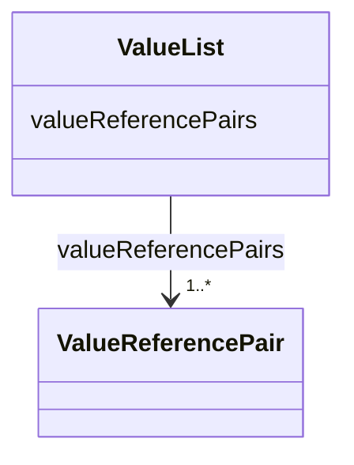

# Class: ValueList 


_A set of value reference pairs._


URI: [aas:ValueList](https://admin-shell.io/aas/3/0/RC02/ValueList)





<!-- no inheritance hierarchy -->


## Slots

| Name | Cardinality and Range | Description | Inheritance |
| ---  | --- | --- | --- |
| [valueReferencePairs](valueReferencePairs.md) | 1..* <br/> [ValueReferencePair](ValueReferencePair.md) | A pair of a value together with its global unique id | direct |


## Usages

| used by | used in | type | used |
| ---  | --- | --- | --- |
| [DataSpecificationIec61360](DataSpecificationIec61360.md) | [valueList](valueList.md) | range | [ValueList](ValueList.md) |


## Identifier and Mapping Information


### Schema Source


* from schema: https://admin-shell.io/aas/3/0/RC02


## Mappings

| Mapping Type | Mapped Value |
| ---  | ---  |
| self | aas:ValueList |
| native | aas:ValueList |


## LinkML Source

<!-- TODO: investigate https://stackoverflow.com/questions/37606292/how-to-create-tabbed-code-blocks-in-mkdocs-or-sphinx -->

### Direct

<details>
```yaml
name: ValueList
description: A set of value reference pairs.
from_schema: https://admin-shell.io/aas/3/0/RC02
attributes:
  valueReferencePairs:
    name: valueReferencePairs
    description: A pair of a value together with its global unique id.
    from_schema: https://admin-shell.io/aas/3/0/RC02
    rank: 1000
    domain_of:
    - ValueList
    range: ValueReferencePair
    required: true
    multivalued: true

```
</details>

### Induced

<details>
```yaml
name: ValueList
description: A set of value reference pairs.
from_schema: https://admin-shell.io/aas/3/0/RC02
attributes:
  valueReferencePairs:
    name: valueReferencePairs
    description: A pair of a value together with its global unique id.
    from_schema: https://admin-shell.io/aas/3/0/RC02
    rank: 1000
    alias: valueReferencePairs
    owner: ValueList
    domain_of:
    - ValueList
    range: ValueReferencePair
    required: true
    multivalued: true

```
</details>