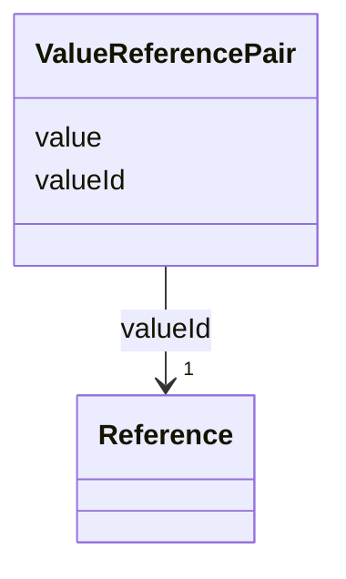

# Class: ValueReferencePair 


_A value reference pair within a value list. Each value has a global unique id defining its semantic._


URI: [aas:ValueReferencePair](https://admin-shell.io/aas/3/0/RC02/ValueReferencePair)





<!-- no inheritance hierarchy -->


## Slots

| Name | Cardinality and Range | Description | Inheritance |
| ---  | --- | --- | --- |
| [value](value.md) | 1 <br/> [String](String.md) | The value of the referenced concept definition of the value in valueId | direct |
| [valueId](valueId.md) | 1 <br/> [Reference](Reference.md) | Global unique id of the value | direct |


## Usages

| used by | used in | type | used |
| ---  | --- | --- | --- |
| [ValueList](ValueList.md) | [valueReferencePairs](valueReferencePairs.md) | range | [ValueReferencePair](ValueReferencePair.md) |


## Identifier and Mapping Information


### Schema Source


* from schema: https://admin-shell.io/aas/3/0/RC02


## Mappings

| Mapping Type | Mapped Value |
| ---  | ---  |
| self | aas:ValueReferencePair |
| native | aas:ValueReferencePair |


## LinkML Source

<!-- TODO: investigate https://stackoverflow.com/questions/37606292/how-to-create-tabbed-code-blocks-in-mkdocs-or-sphinx -->

### Direct

<details>
```yaml
name: ValueReferencePair
description: A value reference pair within a value list. Each value has a global unique
  id defining its semantic.
from_schema: https://admin-shell.io/aas/3/0/RC02
attributes:
  value:
    name: value
    description: The value of the referenced concept definition of the value in valueId.
    from_schema: https://admin-shell.io/aas/3/0/RC02
    domain_of:
    - Blob
    - DataSpecificationIec61360
    - Extension
    - File
    - Key
    - MultiLanguageProperty
    - OperationVariable
    - Property
    - Qualifier
    - ReferenceElement
    - SpecificAssetId
    - SubmodelElementCollection
    - SubmodelElementList
    - ValueReferencePair
    range: string
    required: true
  valueId:
    name: valueId
    description: Global unique id of the value.
    from_schema: https://admin-shell.io/aas/3/0/RC02
    domain_of:
    - MultiLanguageProperty
    - Property
    - Qualifier
    - ValueReferencePair
    range: Reference
    required: true

```
</details>

### Induced

<details>
```yaml
name: ValueReferencePair
description: A value reference pair within a value list. Each value has a global unique
  id defining its semantic.
from_schema: https://admin-shell.io/aas/3/0/RC02
attributes:
  value:
    name: value
    description: The value of the referenced concept definition of the value in valueId.
    from_schema: https://admin-shell.io/aas/3/0/RC02
    alias: value
    owner: ValueReferencePair
    domain_of:
    - Blob
    - DataSpecificationIec61360
    - Extension
    - File
    - Key
    - MultiLanguageProperty
    - OperationVariable
    - Property
    - Qualifier
    - ReferenceElement
    - SpecificAssetId
    - SubmodelElementCollection
    - SubmodelElementList
    - ValueReferencePair
    range: string
    required: true
  valueId:
    name: valueId
    description: Global unique id of the value.
    from_schema: https://admin-shell.io/aas/3/0/RC02
    alias: valueId
    owner: ValueReferencePair
    domain_of:
    - MultiLanguageProperty
    - Property
    - Qualifier
    - ValueReferencePair
    range: Reference
    required: true

```
</details>